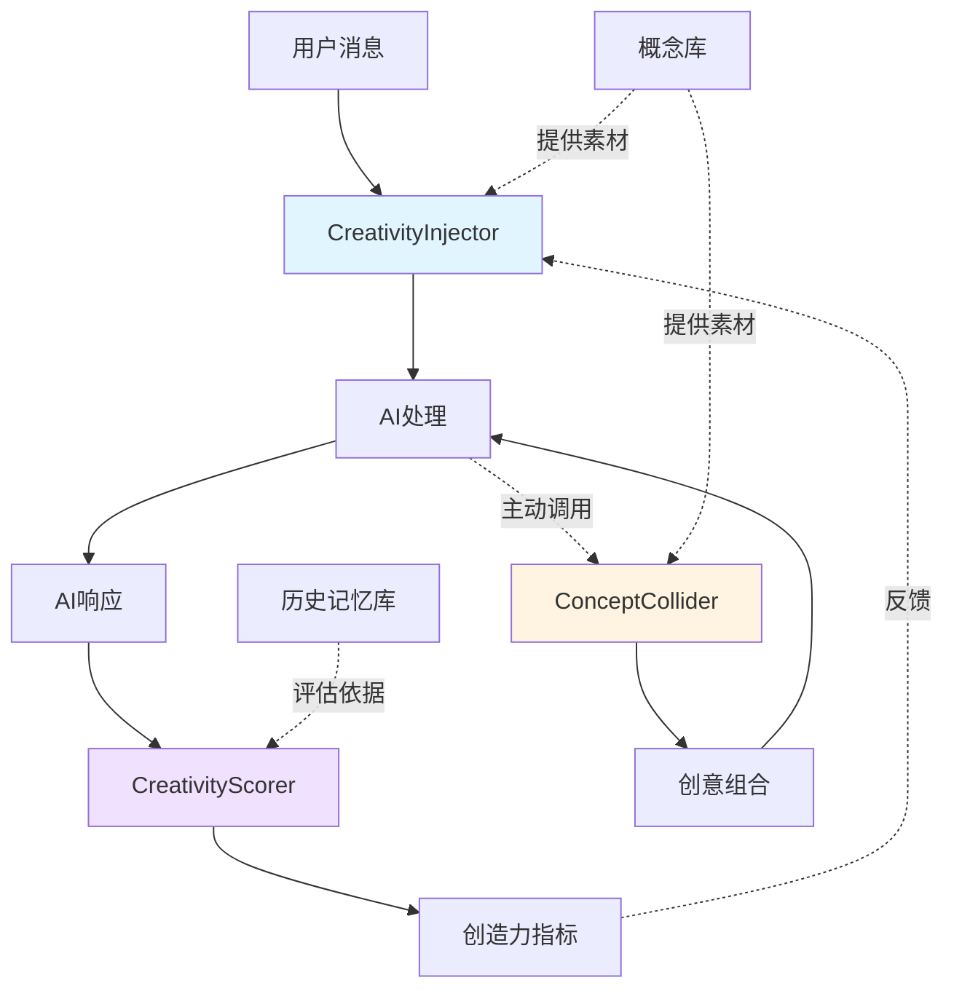
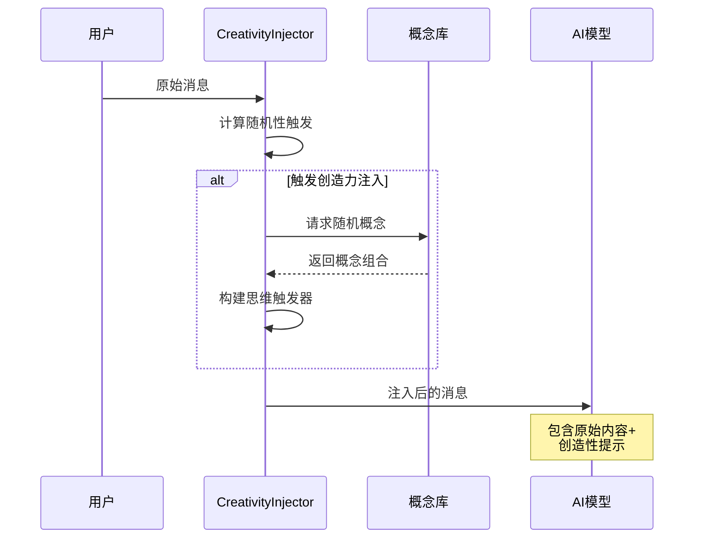
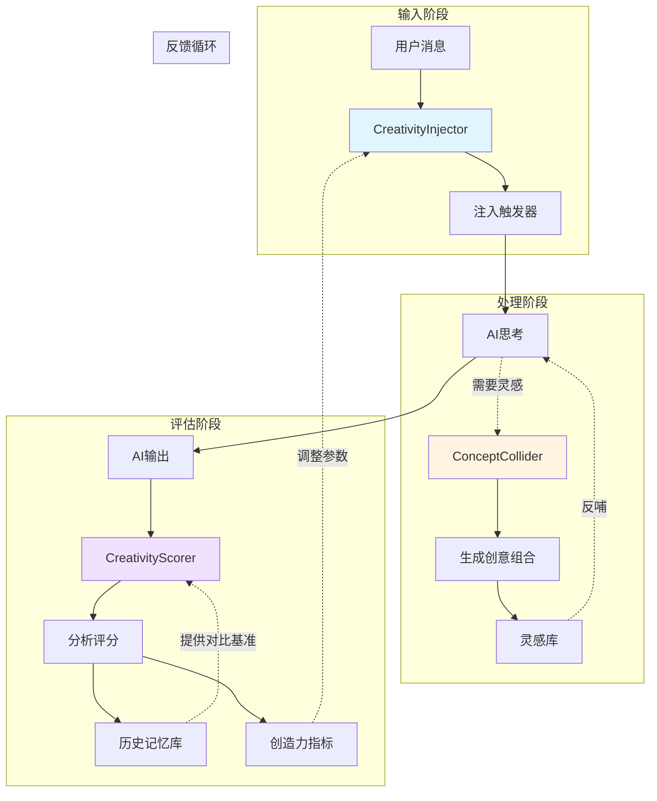
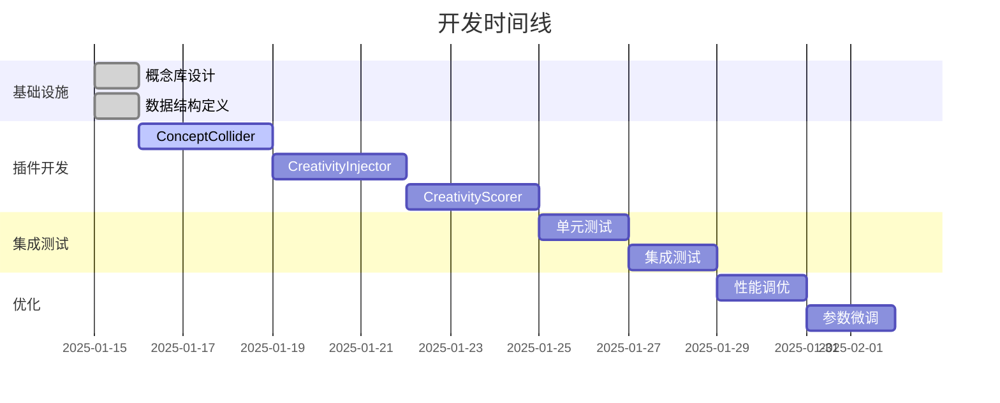

# AI创造力涌现引擎 - 完整设计方案

## 1. 系统架构概览

### 1.1 整体设计理念

AI创造力涌现引擎是一个混合式插件系统，通过三个核心插件协同工作，在不同层面激发和评估AI的创造力：



### 1.2 三大核心插件

| 插件名称 | 类型 | 功能定位 | 触发方式 |
|---------|------|---------|---------|
| **CreativityInjector** | messagePreprocessor | 在消息预处理阶段注入创造性元素 | 自动触发（每条消息） |
| **ConceptCollider** | synchronous | 提供主动的概念碰撞工具 | AI主动调用 |
| **CreativityScorer** | static/scheduled | 评估和量化创造力表现 | 定期自动运行 |

---

## 2. 插件详细设计

### 2.1 CreativityInjector（创造力注入器）

#### 2.1.1 核心功能

在消息发送给AI之前，动态注入创造性思维触发器，打破惯性思维模式。

#### 2.1.2 工作原理



#### 2.1.3 注入策略

**1. 随机性注入模式**

- **触发频率控制**：基于 `trigger_frequency` 参数，不是每条消息都注入
- **强度分级**：`randomness_level` (0-1) 控制注入的激进程度
  - 0.0-0.3：温和提示（"可以考虑..."）
  - 0.4-0.7：中度引导（"尝试将X与Y结合..."）
  - 0.8-1.0：激进挑战（"完全颠覆传统思维..."）

**2. 思维触发器类型**

```javascript
// 触发器示例结构
{
  "metaphor": "将这个问题想象成一个[随机比喻]",
  "crossDomain": "从[领域A]的角度重新审视这个[领域B]的问题",
  "reversal": "如果我们反向思考，得到相反的结论会怎样？",
  "combination": "尝试结合[概念1]和[概念2]的特点",
  "constraint": "假设你只能用[限制条件]来解决这个问题"
}
```

**3. 概念库结构**

```json
{
  "domains": [
    {
      "name": "科学技术",
      "concepts": ["量子纠缠", "神经网络", "基因编辑", "纳米材料"]
    },
    {
      "name": "艺术人文",
      "concepts": ["印象派", "极简主义", "叙事结构", "色彩理论"]
    },
    {
      "name": "自然现象",
      "concepts": ["蝴蝶效应", "涌现现象", "生态平衡", "相变"]
    },
    {
      "name": "社会经济",
      "concepts": ["网络效应", "长尾理论", "博弈论", "规模经济"]
    }
  ],
  "metaphors": [
    "交响乐团", "生态系统", "化学反应", "建筑结构", 
    "棋局", "河流", "星系", "市场"
  ]
}
```

#### 2.1.4 配置参数

```json
{
  "randomness_level": 0.5,
  "trigger_frequency": 3,
  "concept_pool_path": "./data/concept_pool.json",
  "injection_modes": ["metaphor", "crossDomain", "combination"],
  "preserve_original": true,
  "max_injection_length": 200
}
```

#### 2.1.5 实现要点

- **非侵入式设计**：原始用户消息完整保留，触发器作为"系统级建议"追加
- **上下文感知**：分析消息关键词，选择相关度高的概念域
- **历史避免**：记录最近使用的触发器，避免短期重复

---

### 2.2 ConceptCollider（概念碰撞器）

#### 2.2.1 核心功能

AI主动调用的创意工具，接收两个不相关概念，通过算法生成创新组合方案。

#### 2.2.2 工作流程


#### 2.2.3 碰撞模式

**1. metaphor（隐喻模式）**

寻找两个概念之间的深层相似性：

```
输入：concept_a="量子力学", concept_b="烹饪"
输出：
- 叠加态 ≈ 未品尝前的味道：食物在品尝前处于"所有可能味道"的叠加态
- 观察者效应 ≈ 主厨的参与：厨师的介入决定了菜品的最终状态
- 纠缠现象 ≈ 味道协同：某些食材组合会产生远超单独食用的效果
```

**2. practical（实践模式）**

探索跨界应用的可行性：

```
输入：concept_a="区块链", concept_b="农业"
输出：
- 溯源应用：从田地到餐桌的不可篡改记录链
- 智能合约：基于生长数据的自动化灌溉系统
- 分布式存储：多节点记录作物生长数据，防止数据丢失
```

**3. artistic（艺术模式）**

创造美学或概念艺术作品：

```
输入：concept_a="人工智能", concept_b="雕塑"
输出：
- 动态雕塑：根据观众互动实时改变形态的智能装置
- 生成艺术：AI学习艺术家风格后创作的三维作品
- 概念表达：用雕塑形式呈现神经网络的层级结构
```

#### 2.2.4 算法核心

**连接点发现算法**

```python
def find_connection_points(concept_a, concept_b, mode):
    """
    使用多维度分析寻找概念间的连接点
    """
    dimensions = {
        'structure': compare_structures(concept_a, concept_b),
        'function': compare_functions(concept_a, concept_b),
        'dynamics': compare_dynamics(concept_a, concept_b),
        'scale': compare_scales(concept_a, concept_b)
    }
    
    connections = []
    for dim, similarity in dimensions.items():
        if similarity > threshold:
            connections.append({
                'dimension': dim,
                'strength': similarity,
                'bridging_idea': generate_bridge(concept_a, concept_b, dim)
            })
    
    return synthesize_collision_result(connections, mode)
```

#### 2.2.5 输出结构

```json
{
  "status": "success",
  "result": {
    "collision_id": "COL_20250115_001",
    "concepts": {
      "primary": "量子力学",
      "secondary": "烹饪"
    },
    "mode": "metaphor",
    "insights": [
      {
        "title": "叠加态味觉",
        "description": "未品尝前的菜肴处于所有可能味道的叠加态...",
        "novelty_score": 0.85,
        "feasibility_score": 0.45
      },
      {
        "title": "观察者效应主厨",
        "description": "品尝者的期待会实质性影响味觉体验...",
        "novelty_score": 0.78,
        "feasibility_score": 0.60
      }
    ],
    "recommended_next_steps": [
      "探索'测量'（品尝）对'波函数'（味道）的影响",
      "研究多人品尝时的'纠缠效应'"
    ],
    "saved_to_inspiration_vault": true
  }
}
```

---

### 2.3 CreativityScorer（创造力评分器）

#### 2.3.1 核心功能

定期评估AI生成内容的创新度，生成量化指标，形成反馈循环。

#### 2.3.2 评估维度

```mermaid
graph TD
    A[AI生成内容] --> B[多维度评估]
    
    B --> C[新颖度分析]
    B --> D[跨域性分析]
    B --> E[可行性分析]
    
    C --> F[与历史对比]
    D --> G[领域识别]
    E --> H[现实性检查]
    
    F --> I[综合评分]
    G --> I
    H --> I
    
    I --> J[生成指标报告]
    J --> K[{{CreativityMetrics}}]
    
    style I fill:#e1ffe1
```

**1. 新颖度 (Novelty Score)**

- **计算方法**：
  ```python
  novelty = 1 - similarity_to_historical_content(current, history_db)
  ```
- **评分范围**：0.0 - 1.0
  - 0.0-0.3：常规内容（重复已有模式）
  - 0.4-0.6：轻度创新（有新元素但框架传统）
  - 0.7-0.9：显著创新（全新的组合或视角）
  - 0.9-1.0：突破性创新（前所未见的概念）

**2. 跨域性 (Cross-Domain Score)**

- **计算方法**：
  ```python
  domains_involved = identify_knowledge_domains(content)
  cross_domain = len(domains_involved) / max_possible_domains
  interaction_depth = measure_domain_integration(content)
  score = (cross_domain * 0.6) + (interaction_depth * 0.4)
  ```
- **评分标准**：
  - 单领域：0.0-0.2
  - 2-3个领域：0.3-0.5
  - 4+个领域且深度融合：0.6-0.8
  - 创造新的跨域范式：0.9-1.0

**3. 可行性 (Feasibility Score)**

- **计算方法**：
  ```python
  physical_constraints = check_physical_laws(content)
  logical_consistency = verify_logical_coherence(content)
  resource_requirements = estimate_implementation_cost(content)
  feasibility = (physical_constraints + logical_consistency) / 2 - resource_penalty
  ```
- **评分标准**：
  - 完全不可行（违反物理定律）：0.0-0.2
  - 理论可行但成本极高：0.3-0.5
  - 当前技术可实现：0.6-0.8
  - 易于实施：0.9-1.0

#### 2.3.3 综合创造力指数

```python
creativity_index = (
    novelty_score * 0.4 +
    cross_domain_score * 0.35 +
    feasibility_score * 0.25
)
```

**权重说明**：
- 新颖度最重要（40%）：创造力的核心
- 跨域性次之（35%）：突破壁垒的能力
- 可行性保底（25%）：确保不完全脱离现实

#### 2.3.4 历史记忆库结构

```json
{
  "conversations": [
    {
      "id": "conv_20250115_001",
      "timestamp": "2025-01-15T10:30:00Z",
      "content_hash": "a3f5c8d9...",
      "key_concepts": ["量子计算", "机器学习", "优化算法"],
      "domains": ["计算机科学", "物理学"],
      "creativity_scores": {
        "novelty": 0.75,
        "cross_domain": 0.60,
        "feasibility": 0.80,
        "overall": 0.72
      }
    }
  ],
  "statistics": {
    "total_analyzed": 1247,
    "average_novelty": 0.58,
    "average_cross_domain": 0.45,
    "trend": "increasing"
  }
}
```

#### 2.3.5 输出占位符

```
{{CreativityMetrics}}

当前创造力指标：
━━━━━━━━━━━━━━━━━━
📊 新颖度：★★★★☆ (0.78)
🔀 跨域性：★★★☆☆ (0.65)
✅ 可行性：★★★★★ (0.92)
━━━━━━━━━━━━━━━━━━
综合创造力指数：0.77 (高)

近期趋势：📈 持续上升
最强领域：科技×艺术跨界
建议：可尝试更激进的概念组合
```

---

## 3. 插件间协作机制

### 3.1 数据流图



### 3.2 数据共享规范

**1. 灵感库（Inspiration Vault）**

位置：`./data/inspiration_vault.json`

```json
{
  "collisions": [
    {
      "id": "COL_20250115_001",
      "timestamp": "2025-01-15T10:30:00Z",
      "concepts": ["量子力学", "烹饪"],
      "mode": "metaphor",
      "insights": [...],
      "usage_count": 3,
      "effectiveness_rating": 4.5
    }
  ]
}
```

**2. 历史记忆库（History Database）**

位置：`./data/creativity_history.json`

用于存储所有AI输出的摘要和评分，供CreativityScorer进行对比分析。

**3. 概念库（Concept Pool）**

位置：`./data/concept_pool.json`

供CreativityInjector和ConceptCollider共享使用。

### 3.3 触发时机协调

| 时机 | CreativityInjector | ConceptCollider | CreativityScorer |
|------|-------------------|-----------------|------------------|
| 每条用户消息 | ✅ 自动触发 | ❌ | ❌ |
| AI主动请求 | ❌ | ✅ AI调用 | ❌ |
| 每小时定时 | ❌ | ❌ | ✅ 自动运行 |
| 会话结束时 | ❌ | ❌ | ✅ 自动运行 |

---

## 4. 技术实现路线图

### 4.1 开发优先级



### 4.2 技术栈选择

| 组件 | 技术选型 | 理由 |
|------|---------|------|
| **ConceptCollider** | Node.js | 需要快速响应，JSON处理优秀 |
| **CreativityInjector** | Python | 需要NLP能力，语义分析强大 |
| **CreativityScorer** | Python | 需要数据分析和机器学习库 |
| **数据存储** | JSON文件 | 轻量级，易于调试和迁移 |
| **NLP库** | spaCy / transformers | 语义分析和相似度计算 |

### 4.3 关键依赖

```json
{
  "ConceptCollider": {
    "node": ">=18.0.0",
    "dependencies": {
      "natural": "^6.0.0",
      "compromise": "^14.0.0"
    }
  },
  "CreativityInjector": {
    "python": ">=3.9",
    "dependencies": {
      "spacy": "^3.7.0",
      "numpy": "^1.24.0"
    }
  },
  "CreativityScorer": {
    "python": ">=3.9",
    "dependencies": {
      "scikit-learn": "^1.3.0",
      "sentence-transformers": "^2.2.0"
    }
  }
}
```

---

## 5. 配置与部署

### 5.1 环境变量配置

**ConceptCollider** (`Plugin/ConceptCollider/config.env`)
```env
# API密钥（如需调用外部NLP服务）
NLP_API_KEY=your_key_here

# 数据路径
CONCEPT_POOL_PATH=./data/concept_pool.json
INSPIRATION_VAULT_PATH=./data/inspiration_vault.json

# 算法参数
SIMILARITY_THRESHOLD=0.3
MAX_INSIGHTS_PER_COLLISION=5
```

**CreativityInjector** (`Plugin/CreativityInjector/config.env`)
```env
# 注入参数
RANDOMNESS_LEVEL=0.5
TRIGGER_FREQUENCY=3
MAX_INJECTION_LENGTH=200

# 数据路径
CONCEPT_POOL_PATH=./data/concept_pool.json

# 模式配置
ENABLED_MODES=metaphor,crossDomain,combination
```

**CreativityScorer** (`Plugin/CreativityScorer/config.env`)
```env
# 评分参数
NOVELTY_WEIGHT=0.4
CROSS_DOMAIN_WEIGHT=0.35
FEASIBILITY_WEIGHT=0.25

# 数据路径
HISTORY_DB_PATH=./data/creativity_history.json

# 运行配置
SCORING_INTERVAL=3600
AUTO_RUN_ON_SESSION_END=true
```

### 5.2 目录结构

```
VCP_evo/
├── Plugin/
│   ├── ConceptCollider/
│   │   ├── plugin-manifest.json
│   │   ├── config.env
│   │   ├── collider.js
│   │   └── algorithms/
│   │       ├── metaphor.js
│   │       ├── practical.js
│   │       └── artistic.js
│   ├── CreativityInjector/
│   │   ├── plugin-manifest.json
│   │   ├── config.env
│   │   ├── injector.py
│   │   └── triggers/
│   │       ├── trigger_generator.py
│   │       └── context_analyzer.py
│   └── CreativityScorer/
│       ├── plugin-manifest.json
│       ├── config.env
│       ├── scorer.py
│       └── analyzers/
│           ├── novelty.py
│           ├── cross_domain.py
│           └── feasibility.py
├── data/
│   ├── concept_pool.json
│   ├── inspiration_vault.json
│   └── creativity_history.json
└── docs/
    └── AI创造力涌现引擎_完整设计方案.md
```

---

## 6. 监控与优化

### 6.1 关键指标

- **CreativityInjector效果**：AI采纳触发器建议的频率
- **ConceptCollider使用率**：AI主动调用次数
- **CreativityScorer趋势**：创造力指数的长期变化

### 6.2 A/B测试建议

对比启用/禁用创造力引擎时AI的表现：
- 用户满意度
- 解决方案新颖性
- 跨领域知识应用

### 6.3 持续优化方向

1. **概念库扩充**：根据使用统计动态添加高效概念
2. **算法迭代**：优化连接点发现算法的准确性
3. **参数自适应**：根据历史表现自动调整注入强度

---

## 7. 风险与限制

### 7.1 已知风险

| 风险 | 影响 | 缓解措施 |
|------|------|---------|
| 过度随机导致混乱 | AI输出不连贯 | 设置randomness_level上限 |
| 概念碰撞生成无意义结果 | 浪费token | 预过滤低相关性组合 |
| 历史库膨胀 | 性能下降 | 定期归档和摘要 |

### 7.2 使用限制

- **不适用场景**：需要严格专业性的任务（如医疗诊断、法律咨询）
- **计算成本**：CreativityScorer的语义分析可能较耗时
- **冷启动问题**：初期历史数据不足，评分可能不准确

---

## 8. 未来扩展方向

### 8.1 短期（1-3个月）

- [ ] 添加用户反馈机制，让用户为AI输出的创造性打分
- [ ] 实现跨会话的灵感库共享
- [ ] 开发可视化面板展示创造力指标

### 8.2 中期（3-6个月）

- [ ] 引入强化学习，让AI自主学习哪些触发器最有效
- [ ] 开发"创造力风格"配置文件（保守型/平衡型/激进型）
- [ ] 支持多模态概念（图片、音频作为概念输入）

### 8.3 长期（6-12个月）

- [ ] 构建概念知识图谱，实现更智能的连接点发现
- [ ] 开发"创造力协作网络"，多个AI之间的概念碰撞
- [ ] 实现元学习：AI学习如何更好地使用创造力工具

---

## 9. 总结

AI创造力涌现引擎通过三个维度的协同工作，形成了一个完整的创造力激发-执行-评估闭环：

1. **CreativityInjector**：提供持续的创造性刺激
2. **ConceptCollider**：提供按需的创意生成工具
3. **CreativityScorer**：提供量化的反馈机制

这个系统不是替代AI的智能，而是激发其潜在的创造力，让它能够产生更多元、更新颖、更跨界的想法，同时通过评估机制确保创新不脱离实用性。

**设计哲学**：创造力不是魔法，而是可以系统化培养的能力。通过持续的刺激、工具支持和反馈循环，AI可以逐步提升其创造性思维能力。