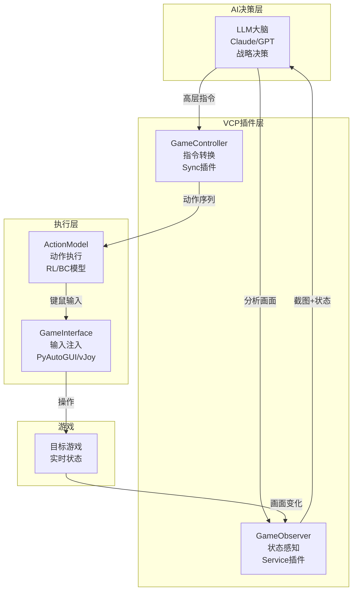
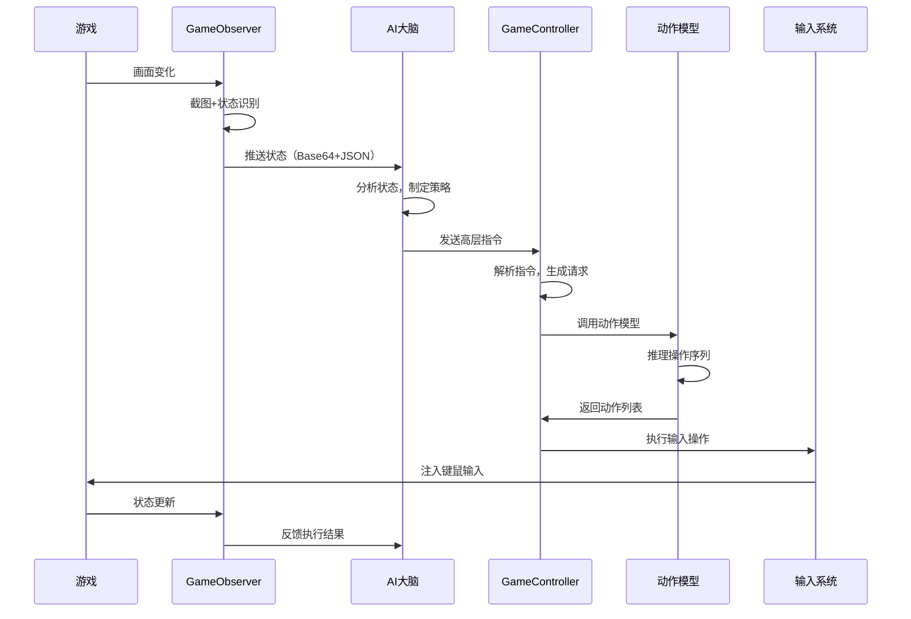

# 游戏AI控制系统 - 完整技术方案

## 1. 系统概述

### 1.1 核心理念

**"大脑"与"手"的分离架构**
- **大脑（LLM）**: 负责高层决策、策略规划、状态分析
- **手（动作模型）**: 负责精确操作执行、反射性动作、技能连招

### 1.2 系统架构



### 1.3 技术优势

1. **低延迟响应**: 动作模型处理反射性操作（<50ms），LLM处理战略决策（可接受秒级延迟）
2. **高精度操作**: 专门训练的模型可以达到人类甚至超人类水平的操作精度
3. **可解释性**: LLM的决策过程可以用自然语言解释
4. **可扩展性**: 通过VCP插件系统，轻松适配不同游戏

## 2. 插件设计

### 2.1 GameObserver 插件

#### 功能定位
游戏状态的"眼睛"，负责捕获并理解游戏当前状态。

#### 插件类型
**Service插件** + **Synchronous插件**（双模式）

#### 核心能力

**能力1: 屏幕捕获**
- 实时截取游戏窗口
- 支持特定区域截取（小地图、血条等）
- 输出Base64编码的图像给LLM

**能力2: 状态识别**
- OCR识别：血量、蓝量、金币等数字信息
- 目标检测：识别敌人、友军、物品位置
- 状态判断：判断角色是否在战斗、是否受伤等

**能力3: 结构化输出**
```json
{
    "timestamp": "2025-01-15T16:42:00Z",
    "player": {
        "health": 85,
        "mana": 60,
        "position": {"x": 1024, "y": 768},
        "status": ["buffed", "in_combat"]
    },
    "enemies": [
        {"id": "enemy_1", "type": "soldier", "distance": 150, "health": 40}
    ],
    "screenshot_base64": "iVBORw0KGgo..."
}
```

#### Service模式功能
- **实时推送**: 每秒推送游戏状态更新
- **事件触发**: 检测到关键事件（如被攻击、任务完成）时立即推送
- **WebSocket通信**: 向VCPLog客户端推送实时数据

#### 技术栈
- **Python**: 主要实现语言
- **mss**: 高性能屏幕截取
- **pytesseract**: OCR文字识别
- **opencv-python**: 图像处理
- **ultralytics**: YOLO目标检测（可选）

---

### 2.2 GameController 插件

#### 功能定位
指令转换的"翻译官"，将LLM的高层语义指令转换为具体的操作序列。

#### 插件类型
**Synchronous插件**（支持串行调用）

#### 核心能力

**能力1: 指令解析**
支持的指令类型：
- `move`: 移动类指令
- `attack`: 攻击类指令
- `skill`: 技能释放
- `interact`: 交互操作
- `combo`: 组合技能

**能力2: 序列生成**
```python
# 示例：将"向左移动并攻击最近的敌人"转换为操作序列
{
    "action": "move_and_attack",
    "parameters": {
        "direction": "left",
        "distance": 100,
        "target": "nearest_enemy",
        "attack_type": "basic"
    }
}
# 转换为
[
    {"type": "keypress", "key": "A", "duration": 0.5},
    {"type": "mouse_move", "target": "enemy_1_position"},
    {"type": "mouse_click", "button": "left"}
]
```

**能力3: 模型调用**
- 调用本地或远程的动作执行模型
- 支持同步和异步执行
- 返回执行结果和反馈

#### 支持的调用格式

**单个指令调用**:
```
<<<[TOOL_REQUEST]>>>
tool_name:「始」GameController「末」,
command:「始」move「末」,
direction:「始」left「末」,
distance:「始」100「末」
<<<[END_TOOL_REQUEST]>>>
```

**串行调用**（一次执行多个操作）:
```
<<<[TOOL_REQUEST]>>>
tool_name:「始」GameController「末」,
command1:「始」skill「末」,
skillName1:「始」fireball「末」,
target1:「始」enemy_1「末」,
command2:「始」move「末」,
direction2:「始」backward「末」,
distance2:「始」50「末」
<<<[END_TOOL_REQUEST]>>>
```

#### 技术栈
- **Node.js**: 实现语言（或Python）
- **axios**: HTTP请求（调用模型API）
- **joi**: 参数验证

---

## 3. 动作执行模型设计

### 3.1 模型架构选择

#### 方案A: 强化学习模型（推荐用于复杂游戏）

**适用场景**: MOBA、FPS、RTS等需要复杂决策的游戏

**架构**:
```python
class RLActionModel:
    def __init__(self):
        self.vision_encoder = ResNet50()  # 视觉编码器
        self.state_encoder = MLP()         # 状态编码器
        self.policy_network = ActorCritic() # 策略网络
        
    def forward(self, observation, high_level_command):
        # 1. 编码视觉信息
        visual_features = self.vision_encoder(observation['image'])
        
        # 2. 编码状态信息
        state_features = self.state_encoder(observation['state'])
        
        # 3. 编码高层指令
        command_embedding = self.encode_command(high_level_command)
        
        # 4. 融合特征
        combined_features = torch.cat([
            visual_features, 
            state_features, 
            command_embedding
        ])
        
        # 5. 生成动作
        action_probs, value = self.policy_network(combined_features)
        
        return action_probs, value
```

**训练方式**:
- 使用PPO（Proximal Policy Optimization）算法
- 奖励函数设计：任务完成+操作效率+存活时间
- 在模拟环境中训练，迁移到真实游戏

#### 方案B: 行为克隆模型（推荐用于快速原型）

**适用场景**: 动作类、平台跳跃类等操作模式相对固定的游戏

**架构**:
```python
class BCActionModel:
    def __init__(self):
        self.vision_encoder = EfficientNet()
        self.temporal_encoder = LSTM()  # 处理时序信息
        self.action_decoder = MLP()
        
    def forward(self, state_sequence, command):
        # 1. 编码视觉序列
        visual_seq = [self.vision_encoder(s) for s in state_sequence]
        
        # 2. LSTM编码时序
        temporal_features, _ = self.temporal_encoder(visual_seq)
        
        # 3. 解码为动作
        action = self.action_decoder(temporal_features[-1], command)
        
        return action
```

**训练方式**:
- 收集人类玩家的游戏录像
- 标注每一帧的操作（键盘、鼠标输入）
- 监督学习：最小化预测操作与真实操作的差异

#### 方案C: 混合模型（最优方案）

**结合两者优势**:
1. 先用行为克隆预训练（快速获得基础能力）
2. 再用强化学习微调（优化特定任务表现）
3. 使用人类反馈强化学习（RLHF）进一步优化

### 3.2 模型输入输出规范

#### 输入格式
```json
{
    "observation": {
        "image": "base64_encoded_screenshot",
        "state": {
            "player_health": 85,
            "player_mana": 60,
            "enemies": [...]
        },
        "history": [...]  // 过去N帧的状态
    },
    "command": {
        "type": "move_and_attack",
        "parameters": {
            "direction": "left",
            "target": "enemy_1"
        }
    }
}
```

#### 输出格式
```json
{
    "actions": [
        {
            "type": "keydown",
            "key": "A",
            "timestamp": 0
        },
        {
            "type": "mouse_move",
            "x": 640,
            "y": 480,
            "timestamp": 100
        },
        {
            "type": "mouse_click",
            "button": "left",
            "timestamp": 150
        },
        {
            "type": "keyup",
            "key": "A",
            "timestamp": 500
        }
    ],
    "expected_duration_ms": 500,
    "confidence": 0.92
}
```

### 3.3 模型部署方案

#### 本地部署
```python
# 作为HTTP服务运行
from flask import Flask, request, jsonify
import torch

app = Flask(__name__)
model = load_model('game_action_model.pth')

@app.route('/execute_action', methods=['POST'])
def execute_action():
    data = request.json
    observation = data['observation']
    command = data['command']
    
    # 推理
    with torch.no_grad():
        actions = model(observation, command)
    
    return jsonify({
        'status': 'success',
        'actions': actions.tolist()
    })

if __name__ == '__main__':
    app.run(host='0.0.0.0', port=5000)
```

#### 远程部署（利用VCP分布式）
- 将模型部署在GPU服务器
- 通过VCP的分布式节点调用
- 支持负载均衡和故障转移

---

## 4. 集成流程

### 4.1 完整执行流程



### 4.2 系统提示词设计

为了让LLM有效使用这个系统，需要在其系统提示词中加入：

```markdown
你是一个游戏AI助手，你拥有以下能力：

{{VCPGameObserver}} - 观察游戏状态，获取实时画面和数据
{{VCPGameController}} - 控制游戏角色执行操作

你的决策流程：
1. 调用GameObserver获取当前游戏状态
2. 分析画面和数据，理解当前局势
3. 制定战略决策（如：攻击哪个敌人、移动到哪里）
4. 调用GameController执行具体操作
5. 观察执行结果，调整策略

重要原则：
- 你负责"思考"，不要尝试描述具体的按键操作
- 使用高层语义指令（如"攻击最近的敌人"而非"按下鼠标左键"）
- 动作模型会处理所有精确的操作执行
- 在战斗中优先使用串行调用以提高效率
```

---

## 5. 文件结构

```
VCPgame/
├── Plugin/
│   ├── GameObserver/
│   │   ├── plugin-manifest.json
│   │   ├── config.env
│   │   ├── observer.py              # 主要逻辑
│   │   ├── screen_capture.py        # 屏幕捕获
│   │   ├── state_recognition.py     # 状态识别
│   │   ├── requirements.txt
│   │   └── README.md
│   │
│   └── GameController/
│       ├── plugin-manifest.json
│       ├── config.env
│       ├── controller.js            # 主要逻辑
│       ├── command_parser.js        # 指令解析
│       ├── action_executor.js       # 动作执行
│       ├── package.json
│       └── README.md
│
├── ActionModel/
│   ├── model_server.py              # 模型服务
│   ├── models/
│   │   ├── rl_model.py              # 强化学习模型
│   │   ├── bc_model.py              # 行为克隆模型
│   │   └── hybrid_model.py          # 混合模型
│   ├── training/
│   │   ├── train_rl.py              # RL训练脚本
│   │   ├── train_bc.py              # BC训练脚本
│   │   └── data_collection.py       # 数据收集
│   ├── input_executor/
│   │   ├── keyboard_mouse.py        # 键鼠输入
│   │   └── gamepad.py               # 手柄输入
│   └── requirements.txt
│
├── configs/
│   ├── game_profiles/               # 不同游戏的配置
│   │   ├── fps_game.json
│   │   ├── moba_game.json
│   │   └── platformer_game.json
│   └── model_config.yaml
│
├── docs/
│   ├── GameAI_Technical_Specification.md  # 本文档
│   ├── API_Reference.md
│   └── Training_Guide.md
│
└── tests/
    ├── test_observer.py
    ├── test_controller.py
    └── integration_test.py
```

---

## 6. 实施路线图

### 阶段1: MVP验证（2-3周）

**目标**: 验证核心概念可行性

- [ ] 实现GameObserver基础版（仅截图+简单OCR）
- [ ] 实现GameController基础版（支持5种基础指令）
- [ ] 使用脚本模拟动作模型（规则驱动）
- [ ] 选择一个简单游戏（如贪吃蛇）进行测试
- [ ] 验证LLM能否有效控制游戏角色

**成功标准**: LLM能够通过观察和控制，完成简单的游戏任务

### 阶段2: 模型集成（3-4周）

**目标**: 引入真正的AI模型

- [ ] 收集游戏录像数据（100+局游戏）
- [ ] 标注数据（每帧的操作）
- [ ] 训练基础行为克隆模型
- [ ] 集成模型到GameController
- [ ] 测试模型执行精度

**成功标准**: 模型能够执行基础操作，准确率>80%

### 阶段3: 系统优化（4-6周）

**目标**: 提升性能和鲁棒性

- [ ] 实现GameObserver的Service模式（实时推送）
- [ ] 添加目标检测（YOLO）
- [ ] 训练强化学习模型
- [ ] 实现串行调用优化
- [ ] 添加异步执行支持
- [ ] 性能优化（降低延迟）

**成功标准**: 系统延迟<100ms，操作准确率>90%

### 阶段4: 扩展适配（持续）

**目标**: 支持多种游戏类型

- [ ] 创建游戏配置模板系统
- [ ] 适配不同类型游戏（FPS、MOBA、RPG）
- [ ] 社区贡献和插件生态
- [ ] 持续优化模型

---

## 7. 关键技术细节

### 7.1 延迟优化策略

**问题**: LLM决策慢（1-3秒），游戏需要实时反应（<100ms）

**解决方案**:

1. **分层决策**:
   - LLM: 战略层决策（每3-5秒）- "攻击谁"、"往哪走"
   - 模型: 战术层执行（实时）- "如何攻击"、"如何移动"

2. **预测性执行**:
   ```python
   # 模型在等待LLM决策时，预测并准备可能的操作
   predicted_actions = model.predict_next_moves(current_state)
   # 一旦收到LLM指令，立即执行最匹配的预测
   ```

3. **并行处理**:
   - GameObserver持续推送状态（独立线程）
   - LLM在后台分析（不阻塞）
   - 模型实时响应紧急情况

### 7.2 状态表示优化

**挑战**: 如何高效传递游戏状态给LLM

**方案**:

1. **分级传递**:
   - 全量：完整截图（仅在关键时刻）
   - 增量：状态变化diff（常规更新）
   - 摘要：文本化描述（持续推送）

2. **关键信息提取**:
   ```python
   # 而非传递完整截图，提取关键信息
   {
       "我方血量": "85%",
       "最近敌人": "距离150像素，血量40%",
       "技能冷却": "火球术可用，冰冻术冷却中（3秒）",
       "资源": "金币500，经验值1250/2000"
   }
   ```

### 7.3 错误恢复机制

**场景**: 模型执行失败、游戏状态异常

**策略**:

1. **执行验证**:
   ```javascript
   async function executeWithVerification(action) {
       const beforeState = await GameObserver.getState();
       await executeAction(action);
       const afterState = await GameObserver.getState();
       
       if (!verifyExpectedChange(beforeState, afterState, action)) {
           // 执行失败，尝试重试或请求LLM介入
           return { success: false, reason: "unexpected_state" };
       }
   }
   ```

2. **降级方案**:
   - 模型失败 → 降级为规则脚本
   - 网络断开 → 切换到本地模型
   - 状态异常 → 请求LLM重新评估

---

## 8. 安全与合规

### 8.1 使用限制

**警告**: 此系统仅用于：
- 单机游戏
- 有明确允许AI使用的游戏
- 研究和学习目的

**禁止用于**:
- 在线多人竞技游戏（违反公平竞争）
- 任何明确禁止自动化的游戏
- 商业作弊目的

### 8.2 技术限制

- 实现速率限制，避免过快操作被检测
- 添加随机性，模拟人类操作模式
- 遵守游戏ToS（服务条款）

---

## 9. 参考资源

### 9.1 相关论文
- "Human-level control through deep reinforcement learning" (DQN)
- "Proximal Policy Optimization Algorithms" (PPO)
- "Learning Dexterous In-Hand Manipulation" (OpenAI)

### 9.2 开源项目
- OpenAI Gym: 强化学习环境
- Stable-Baselines3: RL算法库
- PyAutoGUI: 输入控制库

### 9.3 VCP相关
- VCP插件开发手册（已读）
- VCP分布式架构文档
- VCP多模态系统文档

---

## 10. 总结

这个方案提供了一个完整的、可实施的游戏AI控制系统：

**优势**:
1. ✅ 充分利用VCP的现有能力（多模态、插件系统、分布式）
2. ✅ 清晰的职责分离（LLM决策 + 模型执行）
3. ✅ 可扩展的架构（支持多种游戏、多种模型）
4. ✅ 渐进式实施路线（从简单到复杂）

**下一步行动**:
1. 审核并确认技术方案
2. 选择第一个目标游戏
3. 开始阶段1的实施
4. 迭代优化

让我们开始创建这个激动人心的系统吧！🎮🤖