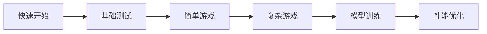

# 快速开始指南 - 5分钟上手

## 🎯 目标

本指南将帮助你在5分钟内理解并开始使用VCP游戏AI控制系统。

## 📋 前置要求

- ✅ Python 3.8+
- ✅ Node.js 14+
- ✅ 一个可以运行的游戏（建议从简单游戏开始）

## 🚀 三步启动

### 步骤1: 切换到Code模式 (1分钟)

当前在Architect模式，需要切换到Code模式才能创建实际文件。

**操作**: 请求用户切换模式或使用`switch_mode`工具。

### 步骤2: 创建文件 (2分钟)

在Code模式下，按照以下顺序创建文件：

**优先级1 - 核心插件**:
```bash
# GameObserver - 最重要
Plugin/GameObserver/plugin-manifest.json
Plugin/GameObserver/observer.py
Plugin/GameObserver/screen_capture.py
Plugin/GameObserver/state_recognition.py
Plugin/GameObserver/requirements.txt
Plugin/GameObserver/config.env

# GameController - 次重要
Plugin/GameController/plugin-manifest.json
Plugin/GameController/controller.js
Plugin/GameController/command_parser.js
Plugin/GameController/action_executor.js
Plugin/GameController/package.json
Plugin/GameController/config.env
```

**优先级2 - 动作模型**:
```bash
ActionModel/model_server.py
ActionModel/models/base_model.py
ActionModel/models/script_model.py
ActionModel/requirements.txt
```

**优先级3 - 可选组件**:
```bash
# 测试文件
tests/test_observer.py
tests/test_controller.js

# 配置模板
configs/game_profiles/fps_game.json
```

### 步骤3: 安装和测试 (2分钟)

```bash
# 安装GameObserver依赖
cd Plugin/GameObserver
pip install -r requirements.txt

# 安装GameController依赖
cd ../GameController
npm install

# 快速测试
cd ../../tests
python test_observer.py
```

## 📖 核心概念速览

### 系统架构

```
用户请求 → LLM分析 → GameObserver捕获状态
                    ↓
              LLM做出决策
                    ↓
         GameController转换指令
                    ↓
         ActionModel执行操作
                    ↓
            游戏接收输入
```

### 工作流程

1. **观察**: GameObserver截图并识别游戏状态
2. **思考**: LLM分析状态并制定策略
3. **行动**: GameController将策略转为具体操作
4. **执行**: ActionModel控制键鼠执行
5. **循环**: 重复以上步骤

## 🎮 第一个示例

### 示例1: 捕获游戏画面

**AI调用**:
```
请帮我捕获当前游戏画面
```

**VCP转换为**:
```
<<<[TOOL_REQUEST]>>>
tool_name:「始」GameObserver「末」,
enable_ocr:「始」false「末」
<<<[END_TOOL_REQUEST]>>>
```

**插件返回**:
```json
{
  "status": "success",
  "result": {
    "screenshot_base64": "iVBORw0KGgo...",
    "window_info": {...}
  }
}
```

### 示例2: 执行移动操作

**AI调用**:
```
向左移动0.5秒
```

**VCP转换为**:
```
<<<[TOOL_REQUEST]>>>
tool_name:「始」GameController「末」,
command:「始」move「末」,
direction:「始」left「末」,
duration_ms:「始」500「末」
<<<[END_TOOL_REQUEST]>>>
```

**插件返回**:
```json
{
  "status": "success",
  "result": {
    "executed_actions": [...]
  }
}
```

### 示例3: 战斗连招（串行调用）

**AI调用**:
```
使用火球术攻击敌人，然后后退
```

**VCP转换为**:
```
<<<[TOOL_REQUEST]>>>
tool_name:「始」GameController「末」,
command1:「始」skill「末」,
skill_name1:「始」fireball「末」,
command2:「始」move「末」,
direction2:「始」backward「末」,
duration_ms2:「始」300「末」
<<<[END_TOOL_REQUEST]>>>
```

## 📝 配置要点

### GameObserver配置

编辑 `Plugin/GameObserver/config.env`:
```env
# 最重要的配置
GAME_WINDOW_TITLE=你的游戏名称

# OCR区域（根据游戏UI调整）
OCR_REGIONS={"health": [10, 10, 100, 30]}
```

### GameController配置

编辑 `Plugin/GameController/config.env`:
```env
# 使用脚本模式（快速测试）
EXECUTION_MODE=script

# 如果有动作模型服务，填写URL
ACTION_MODEL_URL=http://localhost:5000
```

## 🔧 常见问题

### Q1: 找不到游戏窗口？

**解决方案**:
```
1. 使用GetWindowList命令查看所有窗口
2. 检查游戏是否在可见状态（非最小化）
3. 调整GAME_WINDOW_TITLE配置
```

### Q2: OCR识别不准？

**解决方案**:
```
1. 确保Tesseract已正确安装
2. 调整OCR_REGIONS坐标
3. 检查游戏UI是否清晰
4. 尝试调整游戏分辨率
```

### Q3: 操作执行失败？

**解决方案**:
```
1. 确保游戏窗口处于焦点
2. 检查键位映射是否正确
3. 尝试降低操作速度
4. 查看插件日志
```

### Q4: 如何调试？

**方法**:
```bash
# 手动测试插件
echo '{"enable_ocr": false}' | python Plugin/GameObserver/observer.py

# 查看详细输出
node Plugin/GameController/controller.js < test_input.json
```

## 📚 进阶学习

### 学习路径

1. **基础**: 阅读 [`PROJECT_SUMMARY.md`](PROJECT_SUMMARY.md)
2. **详细**: 阅读 [`GameAI_Technical_Specification.md`](GameAI_Technical_Specification.md)
3. **实现**: 参考 [`Plugin_Implementation_Guide.md`](Plugin_Implementation_Guide.md)
4. **优化**: 学习模型训练和性能调优

### 推荐顺序



## 🎯 下一步行动

### 立即行动
1. ✅ 切换到Code模式
2. ✅ 创建GameObserver插件
3. ✅ 创建GameController插件
4. ✅ 运行第一个测试

### 本周目标
1. 完成所有插件创建
2. 在一个简单游戏中测试
3. 收集反馈并优化
4. 分享你的成果！

### 本月目标
1. 支持3种不同类型的游戏
2. 训练基础行为克隆模型
3. 编写游戏配置模板
4. 贡献到社区

## 💡 小贴士

### 开发技巧
- 🎯 先从简单游戏开始（如2D游戏）
- 🎯 先实现基础功能，再追求完美
- 🎯 充分利用串行调用提高效率
- 🎯 使用配置模板快速适配新游戏

### 性能优化
- ⚡ 减少不必要的OCR调用
- ⚡ 使用合适的截图区域
- ⚡ 脚本模式比模型模式快
- ⚡ 批量操作优于单个操作

### 调试建议
- 🐛 使用详细的日志输出
- 🐛 手动测试每个组件
- 🐛 逐步增加复杂度
- 🐛 保留测试用例

## 📞 获取帮助

如果遇到问题：
1. 查看详细文档
2. 检查配置文件
3. 运行测试套件
4. 查看插件日志
5. 社区求助

## 🎉 恭喜！

你现在已经掌握了VCP游戏AI控制系统的基础知识！

**记住核心理念**:
- 🧠 LLM = 大脑（思考）
- 🤖 模型 = 手（执行）
- 🔌 VCP = 连接器（协作）

现在，开始你的AI游戏控制之旅吧！🚀

---

*创建时间: 2025-01-15*  
*预计阅读时间: 5分钟*  
*难度: ⭐⭐☆☆☆*