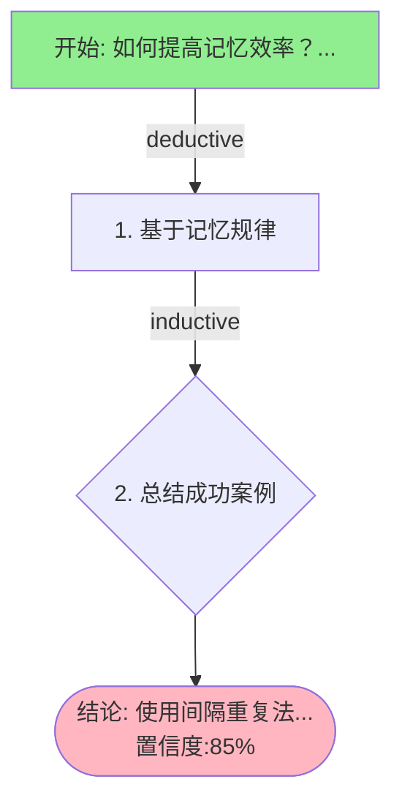

# 推理追踪记录: R-INTEGRATION-001

**时间**: 2025-11-19T14:32:12.151915
**问题**: 如何提高记忆效率？
**结论**: 使用间隔重复法
**整体置信度**: 85.00%

## 推理步骤

### 步骤 1: deductive
基于记忆规律

### 步骤 2: inductive
总结成功案例

## 推理流程图

## 标签
#推理追踪 #reasoning #R-INTEGRATION-001