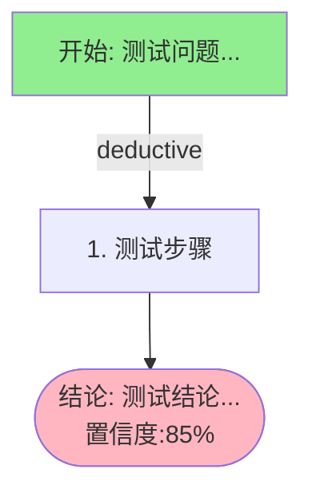

# 推理追踪记录: R-TEST-001

**时间**: 2025-11-19T14:32:10.925304
**问题**: 测试问题
**结论**: 测试结论
**整体置信度**: 85.00%

## 推理步骤

### 步骤 1: deductive
测试步骤

## 推理流程图

```mermaid
graph TD
    START[开始: 测试问题...]
    STEP1["1. 测试步骤"]
    START -->|deductive| STEP1
    END([结论: 测试结论...<br/>置信度:85%])
    STEP1 --> END
    style START fill:#90EE90
    style END fill:#FFB6C1
```

## 标签
#推理追踪 #reasoning #R-TEST-001