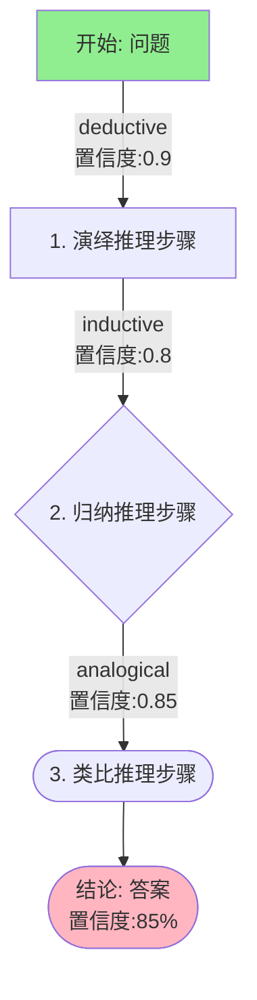
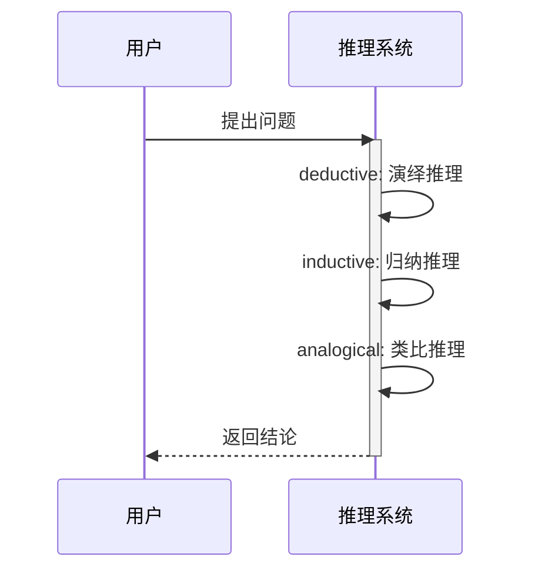

# ReasoningTracer - 推理追踪器

## 功能概述

ReasoningTracer 是一个同步插件，用于记录推理过程、生成可视化流程图，并将推理历史保存到日记系统。支持多种图表类型和格式，便于回顾和分析。

## 核心功能

### 1. 推理步骤记录
- **详细捕获**: 记录每个推理步骤的完整信息
- **时间戳**: 自动添加时间戳标记
- **类型标注**: 区分演绎、归纳、类比等推理类型
- **置信度追踪**: 记录每个步骤的置信度

### 2. 可视化图表生成
- **Mermaid图表**: 生成三种类型的Mermaid图表
  - **流程图** (flowchart): 展示推理流程和步骤关系
  - **序列图** (sequence): 展示用户与系统的交互过程
  - **关系图** (graph): 展示推理步骤之间的关系
- **图片导出**: 使用matplotlib生成PNG格式图表（可选）
- **Base64编码**: 支持将图表嵌入到响应中

### 3. 日记系统集成
- **自动保存**: 自动创建Markdown格式的推理记录
- **结构化文档**: 包含问题、步骤、结论和可视化
- **标签索引**: 添加标签便于检索和分类
- **历史管理**: 自动清理旧记录，保持系统整洁

### 4. 历史回溯
- **JSON存储**: 以JSON格式保存完整的追踪数据
- **查询支持**: 支持按ID、日期、主题查询
- **统计分析**: 可分析推理模式和成功率

## 安装依赖

```bash
cd Plugin/ReasoningTracer
pip install -r requirements.txt
```

**依赖说明**:
- `matplotlib` (可选): 用于生成图片格式的可视化图表
- 如不安装matplotlib，插件仍可正常工作，只是不会生成PNG图表

## 配置说明

编辑 `config.env` 文件：

```env
# 推理追踪输出路径
TRACE_OUTPUT_PATH=./Memory/ReasoningHistory

# 是否生成可视化图表
ENABLE_VISUALIZATION=true

# 是否自动保存到日记
SAVE_TO_DIARY=true

# 最大保留的追踪历史数量
MAX_TRACE_HISTORY=100
```

## 使用方式

### 基础调用

```
<<<[TOOL_REQUEST]>>>
tool_name:「始」ReasoningTracer「末」,
reasoning_id:「始」R-20250115-001「末」,
query:「始」如何提高记忆效率？「末」,
reasoning_steps:「始」[
  {
    "step": 1,
    "type": "deductive",
    "description": "基于艾宾浩斯遗忘曲线理论",
    "confidence": 0.9
  },
  {
    "step": 2,
    "type": "inductive",
    "description": "总结成功案例的共同点",
    "confidence": 0.8
  }
]「末」,
result:「始」应该使用间隔重复法进行记忆训练「末」,
confidence:「始」0.85「末」
<<<[END_TOOL_REQUEST]>>>
```

### 指定可视化类型

```
<<<[TOOL_REQUEST]>>>
tool_name:「始」ReasoningTracer「末」,
reasoning_id:「始」R-20250115-002「末」,
query:「始」技术方案是否可行？「末」,
reasoning_steps:「始」[
  {"step": 1, "type": "analogical", "description": "对比类似项目"},
  {"step": 2, "type": "deductive", "description": "应用技术约束"}
]「末」,
result:「始」方案可行「末」,
visualization_type:「始」sequence「末」
<<<[END_TOOL_REQUEST]>>>
```

### 不保存到日记（临时追踪）

```
<<<[TOOL_REQUEST]>>>
tool_name:「始」ReasoningTracer「末」,
reasoning_id:「始」R-TEST-001「末」,
query:「始」测试问题「末」,
reasoning_steps:「始」[{"step": 1, "type": "deductive", "description": "快速测试"}]「末」,
result:「始」测试结论「末」,
save_to_diary:「始」false「末」
<<<[END_TOOL_REQUEST]>>>
```

## 参数说明

| 参数 | 类型 | 必需 | 默认值 | 说明 |
|------|------|------|--------|------|
| reasoning_id | string | 是 | - | 唯一标识符，建议格式: R-YYYYMMDD-NNN |
| query | string | 是 | - | 原始问题或查询 |
| reasoning_steps | array | 是 | - | 推理步骤列表（JSON数组） |
| result | string | 是 | - | 推理得出的结论 |
| confidence | float | 否 | 0.7 | 整体置信度 (0-1) |
| save_to_diary | boolean | 否 | true | 是否保存到日记系统 |
| visualization_type | string | 否 | 'flowchart' | 可视化类型 |

### reasoning_steps 格式

每个步骤对象应包含：

```json
{
  "step": 1,                    // 步骤序号（必需）
  "type": "deductive",          // 推理类型（必需）
  "description": "步骤描述",     // 描述文字（必需）
  "confidence": 0.85,           // 置信度（可选）
  "data": {...}                 // 其他数据（可选）
}
```

### visualization_type 选项

- `'flowchart'`: 流程图（默认），展示推理流程
- `'sequence'`: 序列图，展示时间顺序
- `'graph'`: 关系图，展示步骤关系

## 输出格式

```json
{
  "status": "success",
  "result": {
    "reasoning_id": "R-20250115-001",
    "trace_summary": "已追踪3个推理步骤（2个deductive，1个inductive），整体置信度85%",
    "mermaid_diagram": "graph TD\n    START[...]...",
    "saved_to_diary": true,
    "diary_path": "Memory/ReasoningHistory/2025-01-15-reasoning-R-20250115-001.md",
    "trace_file": "Memory/ReasoningHistory/R-20250115-001.json",
    "visualization": "data:image/png;base64,...",
    "step_count": 3
  }
}
```

## 输出文件

### 1. JSON追踪文件
位置: `{TRACE_OUTPUT_PATH}/{reasoning_id}.json`

```json
{
  "reasoning_id": "R-20250115-001",
  "timestamp": "2025-01-15T10:30:00",
  "query": "如何提高记忆效率？",
  "result": "应该使用间隔重复法",
  "confidence": 0.85,
  "steps": [...],
  "step_count": 3,
  "mermaid_diagram": "..."
}
```

### 2. Markdown日记文件
位置: `{TRACE_OUTPUT_PATH}/{date}-reasoning-{id}.md`

```markdown
# 推理追踪记录: R-20250115-001

**时间**: 2025-01-15T10:30:00
**问题**: 如何提高记忆效率？
**结论**: 应该使用间隔重复法
**整体置信度**: 85%

## 推理步骤

### 步骤 1: deductive
基于艾宾浩斯遗忘曲线理论
**置信度**: 0.9

### 步骤 2: inductive
总结成功案例的共同点
**置信度**: 0.8

## 推理流程图


## 标签
#推理追踪 #reasoning #R-20250115-001
```

## 可视化图表示例

### 流程图 (Flowchart)


### 序列图 (Sequence)


## 与其他插件协同

### 与 OmniscientReasoner 协同

典型工作流程：
1. OmniscientReasoner执行推理分析
2. 将推理结果传递给ReasoningTracer
3. ReasoningTracer记录过程并生成可视化
4. 推理历史被保存到日记系统

示例集成：
```javascript
// OmniscientReasoner返回结果后
const reasoningResult = await omniscientReasoner.reason(query);

// 调用ReasoningTracer记录
await reasoningTracer.trace({
  reasoning_id: generateId(),
  query: query,
  reasoning_steps: extractSteps(reasoningResult),
  result: reasoningResult.answer,
  confidence: reasoningResult.confidence
});
```

### 与 KnowledgeIndexer 协同
- 推理历史会成为新的记忆数据
- 下次KnowledgeIndexer更新时会索引这些推理记录
- 形成推理知识的积累和复用

### 与 ConfidenceEstimator 协同
- ConfidenceEstimator评估的结果可被追踪记录
- 置信度变化趋势可通过历史数据分析

## 历史记录管理

### 自动清理
- 系统会保留最近的N条记录（默认100条）
- 超过限制的旧记录会被自动删除
- 可通过 `MAX_TRACE_HISTORY` 配置调整

### 手动查询
```python
# 查找特定ID的追踪记录
import json
with open('Memory/ReasoningHistory/R-20250115-001.json') as f:
    trace = json.load(f)

# 统计推理模式
step_types = {}
for step in trace['steps']:
    type_ = step['type']
    step_types[type_] = step_types.get(type_, 0) + 1
```

## 性能优化

### 1. 可视化控制
- 如不需要图表，设置 `ENABLE_VISUALIZATION=false`
- 不安装matplotlib可减少依赖

### 2. 存储优化
- 定期归档旧记录到备份目录
- 调整 `MAX_TRACE_HISTORY` 限制记录数量

### 3. 日记集成
- 如不需要Markdown日记，设置 `SAVE_TO_DIARY=false`
- 减少文件IO操作

## 故障排查

### 问题：无法生成可视化图片
- 检查是否安装了matplotlib: `pip install matplotlib`
- 确认 `ENABLE_VISUALIZATION=true`
- 查看错误日志了解具体原因

### 问题：日记文件未创建
- 确认 `SAVE_TO_DIARY=true`
- 检查 `TRACE_OUTPUT_PATH` 目录权限
- 确保路径存在且可写

### 问题：reasoning_steps解析失败
- 确保传入的是有效的JSON数组
- 检查JSON格式是否正确（引号、逗号等）
- 每个步骤必须包含 `step`, `type`, `description` 字段

### 问题：推理ID冲突
- 使用唯一的reasoning_id
- 建议格式：R-{日期}-{序号}
- 避免重复使用相同ID

## 最佳实践

### 1. ID命名规范
```
R-YYYYMMDD-NNN
R-20250115-001  # 2025年1月15日的第1个推理
R-20250115-002  # 2025年1月15日的第2个推理
```

### 2. 步骤设计
- 每个步骤应该是独立的推理单元
- 提供清晰的描述信息
- 记录置信度便于分析

### 3. 可视化选择
- 简单流程: flowchart
- 强调时序: sequence
- 复杂关系: graph

### 4. 日记管理
- 定期回顾推理历史
- 分析成功和失败的推理模式
- 优化未来的推理策略

## 版本历史

- v1.0.0 (2025-01-15): 初始版本
  - 推理步骤记录
  - 三种Mermaid图表类型
  - Matplotlib可视化
  - 日记系统集成
  - 自动历史管理