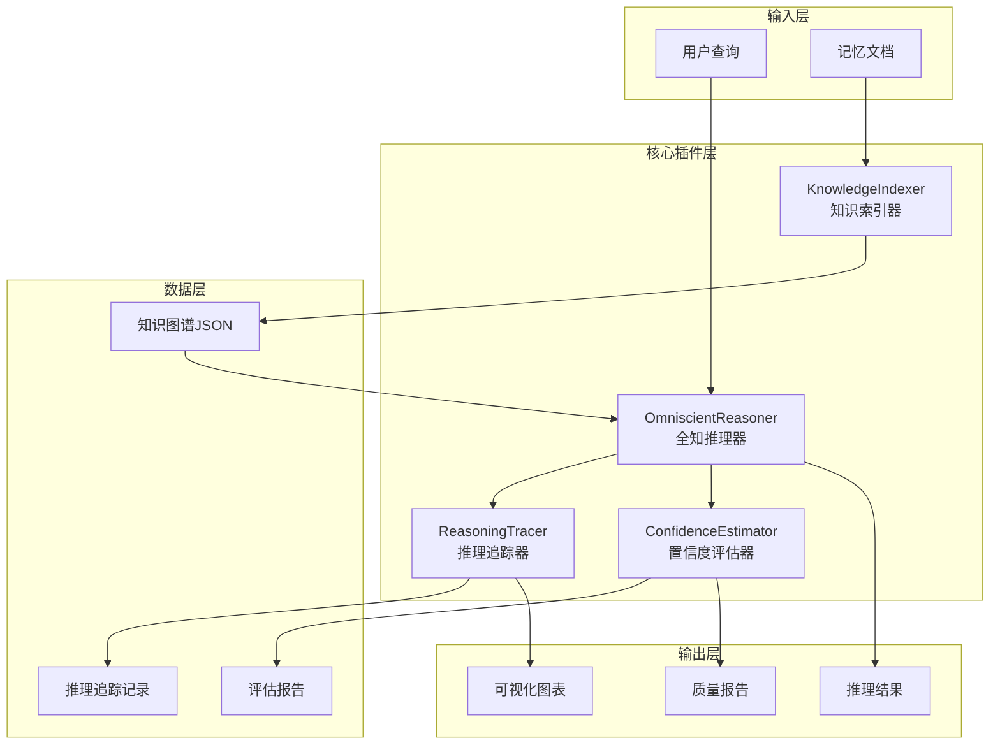
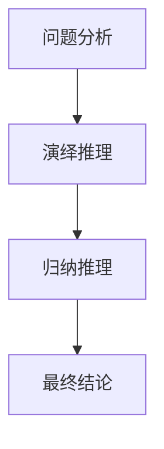

# VCP 推理增强插件系统

[](https://github.com/yourusername/vcp-reasoning-plugins)
[](LICENSE)
[](https://nodejs.org/)
[](https://www.python.org/)

> 基于知识图谱的智能推理工具集，为VCP（Virtual Cherry-Var Protocol）系统提供多模式推理、过程追踪和质量评估能力。

## 📑 目录

- [系统简介](#系统简介)
- [核心特性](#核心特性)
- [快速开始](#快速开始)
- [插件架构](#插件架构)
- [文档导航](#文档导航)
- [项目结构](#项目结构)
- [技术栈](#技术栈)
- [贡献指南](#贡献指南)
- [许可证](#许可证)

## 系统简介

VCP推理增强插件系统是一套完整的知识驱动推理解决方案，通过四个协同工作的插件实现：

🧠 **智能推理** - 结合演绎、归纳、类比三种推理模式  
📊 **知识图谱** - 自动构建和维护知识网络  
🔍 **过程追溯** - 完整记录每一步推理路径  
✅ **质量保证** - 多维度评估结果可信度  

### 适用场景

- ✅ 技术方案选型与评估
- ✅ 项目经验总结与复用
- ✅ 复杂问题分析与决策
- ✅ 知识关联发现与探索
- ✅ 风险识别与质量控制

## 核心特性

### 🎯 多模式推理引擎

三种互补的推理方式提供全面的分析视角：

| 推理模式 | 特点 | 适用场景 |
|---------|------|---------|
| **演绎推理** | 从规则到结论 | 验证逻辑关系、应用已知规律 |
| **归纳推理** | 从案例到规律 | 总结经验模式、提炼最佳实践 |
| **类比推理** | 从相似到推断 | 借鉴历史经验、评估新方案 |

### 📚 智能知识图谱

自动化知识管理系统：

- 🔄 **自动扫描**: 递归扫描Memory目录下的所有Markdown文档
- 🧩 **概念提取**: 识别关键概念和专业术语
- 🔗 **关系构建**: 发现概念间的因果、包含等关系
- 📐 **规则挖掘**: 提取if-then逻辑规则
- 📊 **可视化**: 生成Mermaid图表展示知识网络

### 🔍 推理过程追踪

完整的思维路径记录：

- 📝 **步骤记录**: 记录每个推理步骤的详细信息
- 🎨 **多种图表**: 支持流程图、时序图、关系图
- 💾 **日记集成**: 自动保存到Memory/ReasoningHistory
- 🖼️ **可视化**: 生成Mermaid图表（可选PNG格式）

### ✨ 四维质量评估

科学的置信度评估体系：

| 评估维度 | 权重 | 说明 |
|---------|------|------|
| 逻辑一致性 | 30% | 推理步骤的前后连贯性 |
| 证据充分性 | 25% | 支撑证据的数量和质量 |
| 前提可靠性 | 25% | 假设和前提的可信程度 |
| 结论合理性 | 20% | 结论的合理性和适用性 |

## 快速开始

### 前置要求

- Node.js >= 14.0.0
- Python >= 3.8
- npm 或 yarn

### 安装步骤

```bash
# 1. 克隆仓库
git clone https://github.com/yourusername/vcp-reasoning-plugins.git
cd vcp-reasoning-plugins

# 2. 安装Node.js依赖
cd Plugin/OmniscientReasoner
npm install

cd ../ConfidenceEstimator
npm install

# 3. 安装Python依赖
cd ../KnowledgeIndexer
pip install -r requirements.txt

cd ../ReasoningTracer
pip install -r requirements.txt
```

### 第一次运行

```bash
# 1. 创建测试记忆文档
mkdir -p Memory/Notes
cat > Memory/Notes/example.md << 'EOF'
# 测试知识

## 规则
如果系统负载高，那么应该增加资源。

## 案例
项目A通过增加服务器数量，成功解决了性能问题。
EOF

# 2. 构建知识图谱
cd Plugin/KnowledgeIndexer
echo "{}" | python knowledge_indexer.py

# 3. 执行推理
cd ../OmniscientReasoner
echo '{"query":"如何解决性能问题？","reasoning_mode":"all"}' | node omniscient_reasoner.js
```

**成功！** 您已完成第一次推理查询 🎉

## 插件架构

### 系统架构图



### 四大核心插件

#### 1️⃣ KnowledgeIndexer - 知识索引器

**类型**: Static Plugin  
**语言**: Python 3.8+  
**功能**: 扫描Memory目录，构建知识图谱

**核心能力**:
- 递归扫描Markdown文档
- 概念提取与NLP分词（可选）
- 关系识别（因果、包含、相似等）
- 规则挖掘与模式发现
- Mermaid图表生成

**输出文件**:
- `knowledge_graph.json` - 结构化知识数据
- `knowledge_graph.md` - Mermaid可视化
- `index_log.txt` - 索引日志

📖 [详细文档](Plugin/KnowledgeIndexer/README.md)

---

#### 2️⃣ OmniscientReasoner - 全知推理器

**类型**: Synchronous Plugin  
**语言**: Node.js 14+  
**功能**: 执行多模式推理分析

**核心能力**:
- 演绎推理引擎（规则匹配与推导）
- 归纳推理引擎（模式识别与总结）
- 类比推理引擎（相似度匹配）
- 混合推理策略（综合多模式结果）
- 动态深度控制

**输入示例**:
```json
{
  "query": "如何提高代码质量？",
  "reasoning_mode": "all",
  "reasoning_depth": 5
}
```

📖 [详细文档](Plugin/OmniscientReasoner/README.md)

---

#### 3️⃣ ReasoningTracer - 推理追踪器

**类型**: Synchronous Plugin  
**语言**: Python 3.8+  
**功能**: 记录推理过程，生成可视化

**核心能力**:
- 推理步骤完整记录
- 多种图表类型（flowchart/sequence/graph）
- Mermaid图表生成
- PNG图片导出（可选，需matplotlib）
- 自动日记系统集成

**可视化示例**:


📖 [详细文档](Plugin/ReasoningTracer/README.md)

---

#### 4️⃣ ConfidenceEstimator - 置信度评估器

**类型**: Synchronous Plugin  
**语言**: Node.js 14+  
**功能**: 评估推理结果质量

**核心能力**:
- 四维度评估体系
- 不确定性来源识别
- 风险等级判定（低/中/高）
- 质量等级评分（S/A/B/C/D）
- 改进建议生成

**评估维度**:
```javascript
{
  logic_consistency: 0.3,      // 逻辑一致性
  evidence_sufficiency: 0.25,   // 证据充分性
  premise_reliability: 0.25,    // 前提可靠性
  conclusion_rationality: 0.2   // 结论合理性
}
```

📖 [详细文档](Plugin/ConfidenceEstimator/README.md)

## 文档导航

### 📚 核心文档

| 文档 | 说明 | 适用对象 |
|-----|------|---------|
| [插件开发方案.md](插件开发方案.md) | 完整的技术设计文档 | 开发者 |
| [插件系统使用指南.md](插件系统使用指南.md) | 详细的使用教程 | 用户 |
| [插件集成测试方案.md](插件集成测试方案.md) | 测试策略和用例 | QA/开发者 |
| [同步异步插件开发手册.md](同步异步插件开发手册.md) | VCP插件开发规范 | 插件开发者 |

### 📖 插件文档

每个插件目录下都有独立的README：

- [KnowledgeIndexer/README.md](Plugin/KnowledgeIndexer/README.md)
- [OmniscientReasoner/README.md](Plugin/OmniscientReasoner/README.md)
- [ReasoningTracer/README.md](Plugin/ReasoningTracer/README.md)
- [ConfidenceEstimator/README.md](Plugin/ConfidenceEstimator/README.md)

### 🎯 快速导航

**我想...**

- 🚀 **快速上手** → [插件系统使用指南.md - 快速开始章节](插件系统使用指南.md#快速开始)
- 💡 **了解原理** → [插件开发方案.md - 技术架构章节](插件开发方案.md#技术架构设计)
- 🔧 **配置插件** → [插件系统使用指南.md - 高级配置章节](插件系统使用指南.md#高级配置)
- 🐛 **解决问题** → [插件系统使用指南.md - 故障排查章节](插件系统使用指南.md#故障排查)
- ✅ **测试系统** → [插件集成测试方案.md](插件集成测试方案.md)
- 🛠️ **开发插件** → [同步异步插件开发手册.md](同步异步插件开发手册.md)

## 项目结构

```
VCPgod/
├── README.md                          # 本文件
├── 插件开发方案.md                    # 技术设计文档
├── 插件系统使用指南.md                # 用户手册
├── 插件集成测试方案.md                # 测试文档
├── 同步异步插件开发手册.md            # 插件开发规范
├── plan.txt                           # 项目计划
│
├── Plugin/                            # 插件目录
│   ├── KnowledgeIndexer/              # 知识索引器
│   │   ├── plugin-manifest.json       # 插件配置
│   │   ├── config.env                 # 环境变量
│   │   ├── knowledge_indexer.py       # 主程序
│   │   ├── requirements.txt           # Python依赖
│   │   ├── README.md                  # 插件文档
│   │   └── output/                    # 输出目录
│   │       ├── knowledge_graph.json   # 知识图谱
│   │       └── knowledge_graph.md     # 可视化
│   │
│   ├── OmniscientReasoner/            # 全知推理器
│   │   ├── plugin-manifest.json
│   │   ├── config.env
│   │   ├── omniscient_reasoner.js     # 主程序
│   │   ├── package.json               # Node依赖
│   │   └── README.md
│   │
│   ├── ReasoningTracer/               # 推理追踪器
│   │   ├── plugin-manifest.json
│   │   ├── config.env
│   │   ├── reasoning_tracer.py        # 主程序
│   │   ├── requirements.txt
│   │   ├── README.md
│   │   └── traces/                    # 追踪记录
│   │
│   └── ConfidenceEstimator/           # 置信度评估器
│       ├── plugin-manifest.json
│       ├── config.env
│       ├── confidence_estimator.js    # 主程序
│       ├── package.json
│       └── README.md
│
└── Memory/                            # 记忆库（用户数据）
    ├── Notes/                         # 笔记
    ├── Projects/                      # 项目经验
    └── ReasoningHistory/              # 推理历史
        └── YYYY-MM-DD/                # 按日期组织
```

## 技术栈

### 后端技术

| 技术 | 用途 | 版本要求 |
|-----|------|---------|
| **Python** | KnowledgeIndexer、ReasoningTracer | >= 3.8 |
| **Node.js** | OmniscientReasoner、ConfidenceEstimator | >= 14.0 |
| **pathlib** | 文件路径处理 | 内置 |
| **json** | 数据序列化 | 内置 |
| **re** | 正则表达式 | 内置 |

### 可选依赖

| 库 | 功能 | 安装命令 |
|---|------|---------|
| **jieba** | 中文NLP分词 | `pip install jieba` |
| **matplotlib** | PNG图表生成 | `pip install matplotlib` |

### 数据格式

- **输入**: JSON (stdin)
- **输出**: JSON (stdout)
- **知识库**: JSON + Markdown
- **可视化**: Mermaid + PNG (可选)

## 使用示例

### 示例1: 技术选型决策

```bash
# 1. 准备知识库
cat > Memory/Projects/tech-stack.md << 'EOF'
# 技术栈选型经验

## 项目A: React成功案例
- 团队规模: 15人
- 开发周期: 6个月
- 结果: 按时交付，性能优秀

## 项目B: Vue成功案例  
- 团队规模: 8人
- 开发周期: 3个月
- 结果: 快速上线，易于维护

## 选型规则
如果团队>10人且项目复杂，选择React。
如果团队<10人且需要快速开发，选择Vue。
EOF

# 2. 更新知识图谱
cd Plugin/KnowledgeIndexer
echo "{}" | python knowledge_indexer.py

# 3. 推理分析
cd ../OmniscientReasoner
echo '{
  "query": "我们团队12人，项目较复杂，应该选React还是Vue？",
  "reasoning_mode": "all",
  "reasoning_depth": 6
}' | node omniscient_reasoner.js | tee result.json

# 4. 评估置信度
cd ../ConfidenceEstimator
cat ../OmniscientReasoner/result.json | jq '.result' | \
  jq '{reasoning_result: .}' | \
  node confidence_estimator.js

# 5. 追踪记录
cd ../ReasoningTracer
echo '{
  "reasoning_id": "R-TechStack-2025-01-15",
  "query": "技术栈选型",
  "reasoning_steps": [
    {"step":1,"type":"deductive","description":"应用选型规则","confidence":0.9},
    {"step":2,"type":"analogical","description":"类比项目A","confidence":0.85}
  ],
  "result": "推荐使用React",
  "confidence": 0.88
}' | python reasoning_tracer.py
```

### 示例2: 性能优化方案

```bash
# 完整工作流脚本
cat > analyze_performance.sh << 'EOF'
#!/bin/bash
QUESTION="数据库查询慢，如何优化？"

# 步骤1: 更新知识库
echo "🔄 更新知识库..."
cd Plugin/KnowledgeIndexer
echo "{}" | python knowledge_indexer.py > /dev/null

# 步骤2: 推理分析
echo "🧠 执行推理分析..."
cd ../OmniscientReasoner
REASONING_RESULT=$(echo "{\"query\":\"$QUESTION\",\"reasoning_mode\":\"all\"}" | \
  node omniscient_reasoner.js)

# 步骤3: 评估质量
echo "✅ 评估结果质量..."
cd ../ConfidenceEstimator
CONFIDENCE=$(echo "$REASONING_RESULT" | jq '.result' | \
  jq '{reasoning_result: .}' | \
  node confidence_estimator.js)

# 输出结果
echo ""
echo "📊 分析结果:"
echo "$REASONING_RESULT" | jq -r '.result.answer'
echo ""
echo "🎯 质量评估:"
echo "$CONFIDENCE" | jq '.result | {quality_grade, overall_confidence, risk_level}'
EOF

chmod +x analyze_performance.sh
./analyze_performance.sh
```

## 性能指标

基于标准测试环境（8核CPU，16GB RAM）：

| 插件 | 平均响应时间 | 内存占用 | 并发能力 |
|-----|------------|---------|---------|
| KnowledgeIndexer | 5-30秒* | ~200MB | 单实例 |
| OmniscientReasoner | 2-8秒 | ~150MB | 多实例 |
| ReasoningTracer | 1-3秒 | ~100MB | 多实例 |
| ConfidenceEstimator | 0.5-2秒 | ~80MB | 多实例 |

*取决于文档数量，100个文档约10秒

## 最佳实践

### ✅ 知识库维护

1. **定期更新**: 每天或每周运行一次KnowledgeIndexer
2. **文档质量**: 清晰的标题、结构化内容、明确的因果关系
3. **合理分类**: 按主题组织Memory目录
4. **版本控制**: 使用Git管理知识库

### ✅ 提问技巧

1. **具体明确**: "如何优化PostgreSQL查询性能？" ✓  
   而非: "怎么提速？" ✗
2. **提供上下文**: 包含项目规模、技术栈等关键信息
3. **分步提问**: 复杂问题拆分为子问题

### ✅ 结果验证

1. **查看置信度**: 优先采纳高置信度（>0.8）结果
2. **检查推理过程**: 使用ReasoningTracer追溯思路
3. **结合专业判断**: 系统是辅助工具，不能完全替代人的决策

## 常见问题

<details>
<summary><b>Q: 系统对硬件有什么要求？</b></summary>

**A**: 最低配置:
- CPU: 双核2GHz+
- 内存: 4GB+
- 磁盘: 1GB可用空间

推荐配置:
- CPU: 四核3GHz+
- 内存: 8GB+
- SSD存储
</details>

<details>
<summary><b>Q: 支持哪些语言？</b></summary>

**A**: 
- ✅ 中文：完全支持
- ✅ 英文：完全支持
- ⚠️ 其他语言：基础支持，效果可能不佳
</details>

<details>
<summary><b>Q: 如何提高推理准确性？</b></summary>

**A**: 三个关键因素：
1. 丰富知识库（添加更多高质量文档）
2. 精确提问（明确具体的问题）
3. 选对推理模式（根据场景选择）
</details>

<details>
<summary><b>Q: 可以商用吗？</b></summary>

**A**: 遵循MIT许可证，可自由使用、修改和商用。
</details>

更多问题请查看[完整FAQ](插件系统使用指南.md#常见问题)。

## 路线图

### v1.1.0 (计划中)
- [ ] Web UI界面
- [ ] 实时推理API
- [ ] 多用户支持
- [ ] 云端知识库同步

### v1.2.0 (规划中)
- [ ] 机器学习增强
- [ ] 自动知识更新
- [ ] 推理结果缓存
- [ ] 性能优化

## 贡献指南

欢迎贡献！请遵循以下步骤：

1. **Fork** 本仓库
2. **创建分支**: `git checkout -b feature/AmazingFeature`
3. **提交更改**: `git commit -m 'Add some AmazingFeature'`
4. **推送分支**: `git push origin feature/AmazingFeature`
5. **提交PR**: 创建Pull Request

### 开发规范

- 代码风格: 遵循各语言标准规范（PEP8/Airbnb）
- 提交信息: 使用[约定式提交](https://www.conventionalcommits.org/)
- 测试覆盖: 新功能需包含单元测试
- 文档更新: 功能变更需同步更新文档

## 许可证

本项目采用 [MIT License](LICENSE) 开源协议。

## 致谢

感谢以下开源项目：

- [Mermaid](https://mermaid.js.org/) - 图表可视化
- [jieba](https://github.com/fxsjy/jieba) - 中文分词
- [matplotlib](https://matplotlib.org/) - 图表生成

## 联系方式

- 📧 Email: your.email@example.com
- 💬 讨论区: [GitHub Discussions](https://github.com/yourusername/vcp-reasoning-plugins/discussions)
- 🐛 问题反馈: [GitHub Issues](https://github.com/yourusername/vcp-reasoning-plugins/issues)

---

<div align="center">

**⭐ 如果这个项目对你有帮助，请给个Star！**

Made with ❤️ by VCP Development Team

</div>