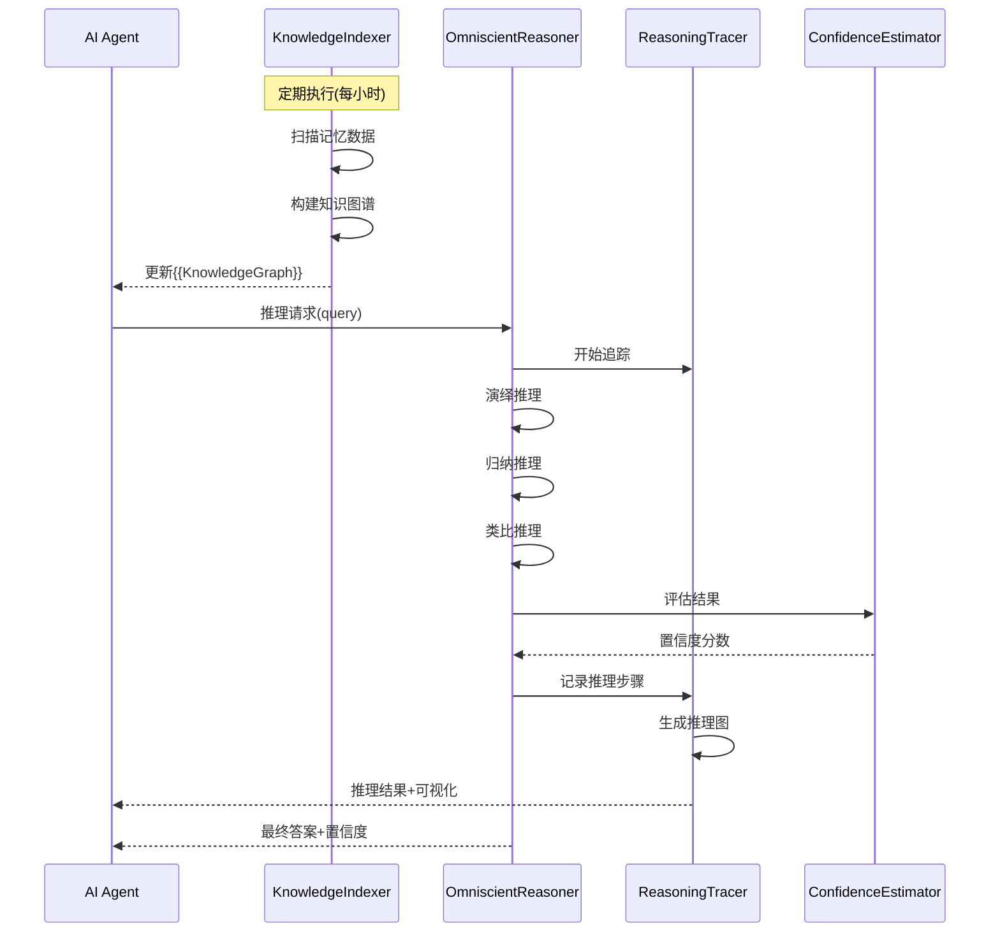

# VCP 推理增强插件系统 - 技术方案

## 1. 系统概述

本方案设计了四个协同工作的插件，用于增强AI的推理能力和知识管理：

1. **KnowledgeIndexer** (Static插件) - 知识索引器
2. **OmniscientReasoner** (Synchronous插件) - 全知推理器
3. **ReasoningTracer** (Synchronous插件) - 推理追踪器
4. **ConfidenceEstimator** (Synchronous插件) - 置信度评估器

### 1.1 系统架构图

```mermaid
graph TB
    A[AI Agent] -->|定期触发| B[KnowledgeIndexer]
    A -->|推理请求| C[OmniscientReasoner]
    C -->|推理过程| D[ReasoningTracer]
    C -->|结果评估| E[ConfidenceEstimator]
    B -->|知识图谱| F[{{KnowledgeGraph}}占位符]
    F -->|上下文增强| A
    D -->|保存推理历史| G[DailyNoteWrite]
    E -->|置信度标注| C
```

### 1.2 数据流设计



## 2. 插件详细设计

### 2.1 KnowledgeIndexer (Static插件)

#### 功能描述
定期扫描所有记忆数据，构建概念关系图、规则库和模式库，通过占位符提供索引数据。

#### 技术规格

**plugin-manifest.json 结构：**
```json
{
  "name": "KnowledgeIndexer",
  "displayName": "知识索引器",
  "pluginType": "static",
  "entryPoint": {
    "type": "python",
    "command": "python knowledge_indexer.py"
  },
  "communication": {
    "protocol": "stdio",
    "timeout": 300000
  },
  "staticUpdateSchedule": {
    "enabled": true,
    "intervalMinutes": 60,
    "placeholderName": "KnowledgeGraph"
  },
  "configSchema": {
    "MEMORY_DATA_PATH": {
      "type": "string",
      "description": "记忆数据存储路径",
      "default": "./Memory"
    },
    "INDEX_OUTPUT_PATH": {
      "type": "string",
      "description": "索引输出路径",
      "default": "./KnowledgeIndex"
    },
    "MAX_CONCEPTS": {
      "type": "integer",
      "description": "最大概念数量",
      "default": 1000
    }
  }
}
```

**核心功能模块：**
1. **记忆扫描器** (MemoryScanner)
   - 递归扫描记忆目录
   - 解析Markdown文档
   - 提取关键信息

2. **概念提取器** (ConceptExtractor)
   - NLP分词和实体识别
   - 关键概念提取
   - 概念频率统计

3. **关系构建器** (RelationshipBuilder)
   - 概念共现分析
   - 因果关系识别
   - 层次结构构建

4. **图谱生成器** (GraphGenerator)
   - 生成JSON格式知识图谱
   - 创建Mermaid可视化图表
   - 构建索引数据结构

#### 输出格式
```json
{
  "status": "success",
  "result": {
    "summary": "已索引1523个概念，2847个关系",
    "conceptCount": 1523,
    "relationCount": 2847,
    "topConcepts": ["推理", "记忆", "知识图谱", "..."],
    "knowledgeGraph": {
      "nodes": [...],
      "edges": [...]
    },
    "rules": [...],
    "patterns": [...]
  }
}
```

---

### 2.2 OmniscientReasoner (Synchronous插件)

#### 功能描述
接收问题，执行三种推理模式（演绎、归纳、类比），返回答案和置信度。

#### 技术规格

**plugin-manifest.json 结构：**
```json
{
  "name": "OmniscientReasoner",
  "displayName": "全知推理器",
  "pluginType": "synchronous",
  "entryPoint": {
    "type": "nodejs",
    "command": "node omniscient_reasoner.js"
  },
  "communication": {
    "protocol": "stdio",
    "timeout": 30000
  },
  "configSchema": {
    "REASONING_MODEL": {
      "type": "string",
      "description": "推理模型选择",
      "default": "hybrid"
    },
    "MAX_REASONING_DEPTH": {
      "type": "integer",
      "description": "最大推理深度",
      "default": 5
    }
  },
  "capabilities": {
    "invocationCommands": [
      {
        "commandIdentifier": "Reason",
        "description": "执行全知推理分析。\n功能：\n- 演绎推理：从一般原理推导具体结论\n- 归纳推理：从具体案例总结一般规律\n- 类比推理：基于相似性进行推断\n\n参数：\n- query (字符串, 必需): 需要推理的问题\n- reasoning_depth (整数, 可选): 推理深度(1-10)，默认5\n- confidence_threshold (浮点数, 可选): 置信度阈值(0-1)，默认0.7\n- reasoning_mode (字符串, 可选): 推理模式('deductive'/'inductive'/'analogical'/'all')，默认'all'\n\n调用格式：\n<<<[TOOL_REQUEST]>>>\ntool_name:「始」OmniscientReasoner「末」,\nquery:「始」如何提高记忆效率？「末」,\nreasoning_depth:「始」5「末」,\nconfidence_threshold:「始」0.7「末」\n<<<[END_TOOL_REQUEST]>>>",
        "example": "<<<[TOOL_REQUEST]>>>\ntool_name:「始」OmniscientReasoner「末」,\nquery:「始」基于过往记忆，预测明天的工作重点「末」,\nreasoning_mode:「始」all「末」\n<<<[END_TOOL_REQUEST]>>>"
      }
    ]
  }
}
```

**核心推理引擎：**

1. **演绎推理引擎** (DeductiveEngine)
   ```javascript
   // 从一般到特殊
   // 大前提 + 小前提 => 结论
   class DeductiveEngine {
     async reason(query, knowledgeBase) {
       // 1. 识别相关规则
       // 2. 应用逻辑推导
       // 3. 验证结论有效性
     }
   }
   ```

2. **归纳推理引擎** (InductiveEngine)
   ```javascript
   // 从特殊到一般
   // 案例1 + 案例2 + 案例3 => 一般规律
   class InductiveEngine {
     async reason(query, examples) {
       // 1. 收集相关案例
       // 2. 识别共同模式
       // 3. 总结一般规律
     }
   }
   ```

3. **类比推理引擎** (AnalogicalEngine)
   ```javascript
   // 基于相似性推理
   // 源域问题 + 目标域问题 => 映射解决方案
   class AnalogicalEngine {
     async reason(query, similarCases) {
       // 1. 查找相似场景
       // 2. 映射关系结构
       // 3. 迁移解决方案
     }
   }
   ```

#### 输入/输出格式
```json
// 输入
{
  "query": "如何提高记忆效率？",
  "reasoning_depth": 5,
  "confidence_threshold": 0.7,
  "reasoning_mode": "all"
}

// 输出
{
  "status": "success",
  "result": {
    "query": "如何提高记忆效率？",
    "answer": "基于记忆规律分析，建议采用间隔重复法...",
    "confidence": 0.85,
    "reasoning_process": {
      "deductive": {
        "premises": [...],
        "conclusion": "...",
        "confidence": 0.9
      },
      "inductive": {
        "cases": [...],
        "pattern": "...",
        "confidence": 0.8
      },
      "analogical": {
        "similar_cases": [...],
        "mapping": {...},
        "confidence": 0.85
      }
    },
    "uncertainty_sources": [...]
  }
}
```

---

### 2.3 ReasoningTracer (Synchronous插件)

#### 功能描述
记录推理过程，生成推理图，保存到日记系统。

#### 技术规格

**plugin-manifest.json 结构：**
```json
{
  "name": "ReasoningTracer",
  "displayName": "推理追踪器",
  "pluginType": "synchronous",
  "entryPoint": {
    "type": "python",
    "command": "python reasoning_tracer.py"
  },
  "communication": {
    "protocol": "stdio",
    "timeout": 15000
  },
  "capabilities": {
    "invocationCommands": [
      {
        "commandIdentifier": "TraceReasoning",
        "description": "追踪和记录推理过程。\n功能：\n- 记录推理步骤\n- 生成推理流程图\n- 保存到日记系统\n\n参数：\n- reasoning_id (字符串, 必需): 推理任务ID\n- reasoning_steps (数组, 必需): 推理步骤列表\n- query (字符串, 必需): 原始问题\n- result (字符串, 必需): 推理结果\n- save_to_diary (布尔, 可选): 是否保存到日记，默认true\n\n调用格式：\n<<<[TOOL_REQUEST]>>>\ntool_name:「始」ReasoningTracer「末」,\nreasoning_id:「始」R-20250115-001「末」,\nquery:「始」原始问题「末」,\nreasoning_steps:「始」[{\"step\":1,\"type\":\"deductive\",...}]「末」,\nresult:「始」推理结论「末」\n<<<[END_TOOL_REQUEST]>>>",
        "example": "..."
      }
    ]
  }
}
```

**核心功能：**

1. **步骤记录器** (StepRecorder)
   - 捕获每个推理步骤
   - 记录时间戳和依赖关系
   - 标注推理类型

2. **图表生成器** (ChartGenerator)
   - 生成Mermaid流程图
   - 创建推理树可视化
   - 导出SVG/PNG图表

3. **日记集成器** (DiaryIntegrator)
   - 调用DailyNoteWrite工具
   - 格式化推理历史
   - 创建标签和索引

#### 输出格式
```json
{
  "status": "success",
  "result": {
    "reasoning_id": "R-20250115-001",
    "trace_summary": "记录了5个推理步骤",
    "mermaid_diagram": "graph TD\nA[问题]-->B[演绎推理]...",
    "saved_to_diary": true,
    "diary_path": "Memory/2025/01/15-reasoning-trace.md",
    "visualization": "data:image/svg+xml;base64,..."
  }
}
```

---

### 2.4 ConfidenceEstimator (Synchronous插件)

#### 功能描述
评估推理结果的可信度，标注不确定性来源。

#### 技术规格

**plugin-manifest.json 结构：**
```json
{
  "name": "ConfidenceEstimator",
  "displayName": "置信度评估器",
  "pluginType": "synchronous",
  "entryPoint": {
    "type": "nodejs",
    "command": "node confidence_estimator.js"
  },
  "communication": {
    "protocol": "stdio",
    "timeout": 10000
  },
  "capabilities": {
    "invocationCommands": [
      {
        "commandIdentifier": "EstimateConfidence",
        "description": "评估推理结果的置信度。\n功能：\n- 计算置信度分数(0-1)\n- 识别不确定性来源\n- 提供改进建议\n\n参数：\n- reasoning_result (对象, 必需): 推理结果对象\n- evaluation_criteria (数组, 可选): 评估标准列表\n\n评估维度：\n- 逻辑一致性\n- 证据充分性\n- 前提可靠性\n- 结论合理性\n\n调用格式：\n<<<[TOOL_REQUEST]>>>\ntool_name:「始」ConfidenceEstimator「末」,\nreasoning_result:「始」{\"answer\":\"...\",\"reasoning_process\":{...}}「末」\n<<<[END_TOOL_REQUEST]>>>",
        "example": "..."
      }
    ]
  }
}
```

**评估算法：**

1. **逻辑一致性检查器** (LogicConsistencyChecker)
   ```javascript
   // 检查推理过程中的逻辑矛盾
   // 评分 = 1 - (矛盾数 / 总步骤数)
   ```

2. **证据充分性评估器** (EvidenceSufficiencyEvaluator)
   ```javascript
   // 评估证据数量和质量
   // 考虑证据来源、相关性、时效性
   ```

3. **前提可靠性分析器** (PremiseReliabilityAnalyzer)
   ```javascript
   // 分析推理前提的可靠性
   // 追溯信息来源和验证状态
   ```

4. **综合置信度计算器** (OverallConfidenceCalculator)
   ```javascript
   // 加权平均各维度得分
   // confidence = w1*logic + w2*evidence + w3*premise + w4*conclusion
   ```

#### 输出格式
```json
{
  "status": "success",
  "result": {
    "overall_confidence": 0.85,
    "dimension_scores": {
      "logic_consistency": 0.9,
      "evidence_sufficiency": 0.8,
      "premise_reliability": 0.85,
      "conclusion_rationality": 0.9
    },
    "uncertainty_sources": [
      {
        "type": "insufficient_evidence",
        "description": "关于X的证据不足",
        "impact": "medium",
        "suggestion": "建议收集更多相关案例"
      }
    ],
    "risk_level": "low",
    "improvement_suggestions": [...]
  }
}
```

## 3. 插件协同工作流程

### 3.1 典型使用场景

**场景1：知识增强推理**
```
1. KnowledgeIndexer定期更新知识图谱
2. AI收到复杂问题
3. AI调用OmniscientReasoner，自动访问{{KnowledgeGraph}}增强上下文
4. OmniscientReasoner执行多模式推理
5. 推理过程由ReasoningTracer记录
6. ConfidenceEstimator评估结果可信度
7. AI综合所有结果给出答案
```

**场景2：推理历史回顾**
```
1. AI需要回顾过往推理
2. 通过ReasoningTracer保存的日记查找历史推理
3. 分析推理模式和成功率
4. 优化未来推理策略
```

### 3.2 数据存储结构

```
VCPgod/
├── Plugin/
│   ├── KnowledgeIndexer/
│   │   ├── plugin-manifest.json
│   │   ├── config.env
│   │   └── knowledge_indexer.py
│   ├── OmniscientReasoner/
│   │   ├── plugin-manifest.json
│   │   ├── config.env
│   │   └── omniscient_reasoner.js
│   ├── ReasoningTracer/
│   │   ├── plugin-manifest.json
│   │   ├── config.env
│   │   └── reasoning_tracer.py
│   └── ConfidenceEstimator/
│       ├── plugin-manifest.json
│       ├── config.env
│       └── confidence_estimator.js
├── KnowledgeIndex/
│   ├── concept_graph.json
│   ├── rules_database.json
│   └── pattern_library.json
└── Memory/
    └── ReasoningHistory/
        ├── 2025-01-15-reasoning-trace.md
        └── ...
```

## 4. 技术依赖

### Python依赖 (requirements.txt)
```
jieba>=0.42.1          # 中文分词
networkx>=3.0          # 图结构处理
matplotlib>=3.7.0      # 图表生成
requests>=2.31.0       # HTTP请求
markdown>=3.5.0        # Markdown解析
```

### Node.js依赖 (package.json)
```json
{
  "dependencies": {
    "natural": "^6.0.0",        // NLP处理
    "compromise": "^14.0.0",    // 文本分析
    "mermaid": "^10.0.0",       // 图表生成
    "winston": "^3.11.0"        // 日志记录
  }
}
```

## 5. 测试计划

### 5.1 单元测试
- 每个插件的核心功能独立测试
- 输入/输出格式验证
- 错误处理测试

### 5.2 集成测试
- 插件间协同工作测试
- 数据流完整性测试
- 性能和超时测试

### 5.3 场景测试
- 复杂推理任务端到端测试
- 知识图谱更新和使用测试
- 历史记录和回溯测试

## 6. 性能优化策略

1. **KnowledgeIndexer优化**
   - 增量更新而非全量重建
   - 使用缓存机制
   - 并行处理多个文档

2. **OmniscientReasoner优化**
   - 推理深度自适应调整
   - 提前终止低置信度分支
   - 结果缓存

3. **ReasoningTracer优化**
   - 异步写入日记
   - 压缩历史记录
   - 定期归档

4. **ConfidenceEstimator优化**
   - 快速预评估机制
   - 轻量级评估模式
   - 并行维度评估

## 7. 未来扩展方向

1. **多Agent协同推理**
   - 支持多个Agent共享知识图谱
   - 分布式推理任务分配

2. **推理模型优化**
   - 引入机器学习模型
   - 推理策略自动优化

3. **可视化增强**
   - 实时推理过程可视化
   - 交互式知识图谱浏览

4. **多语言支持**
   - 支持英文、中文等多语言推理
   - 跨语言知识迁移

---

**文档版本**: 1.0.0  
**创建日期**: 2025-01-15  
**作者**: VCP开发团队