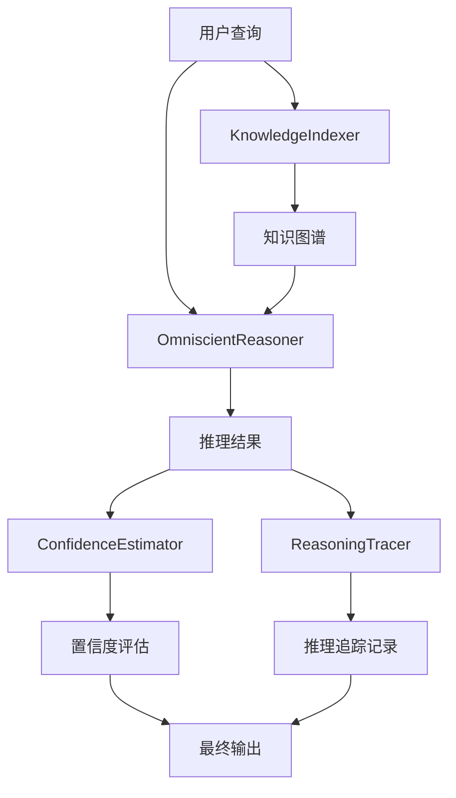
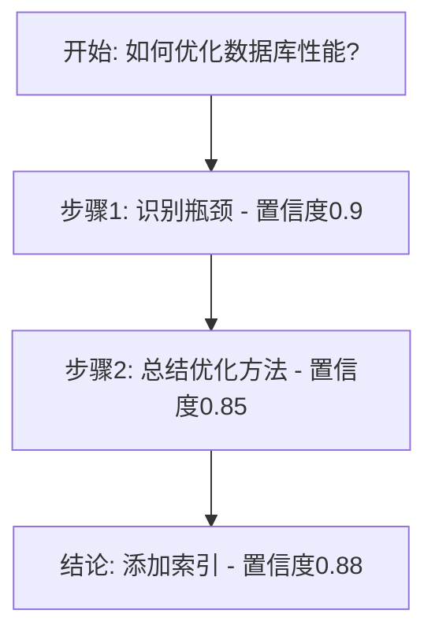
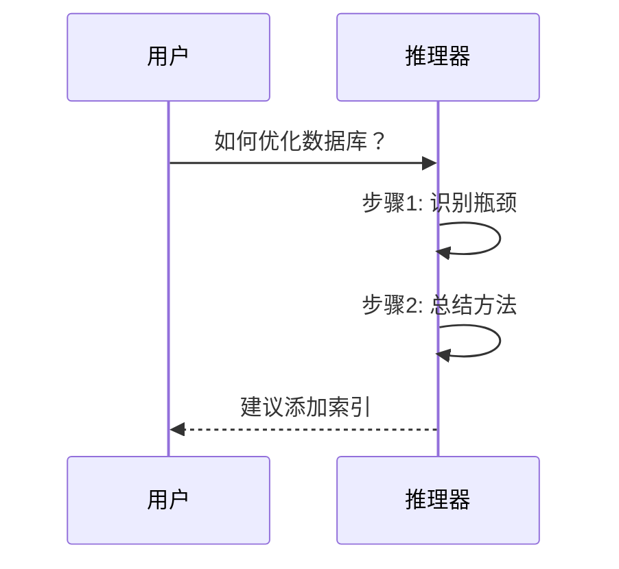
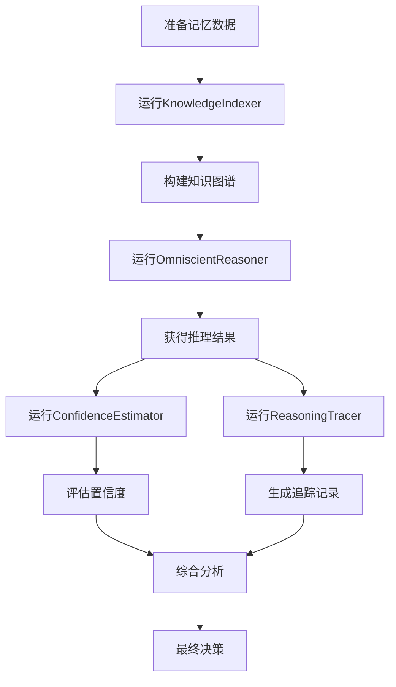

# VCP 推理增强插件系统 - 完整使用指南

## 📖 目录

1. [系统简介](#系统简介)
2. [快速开始](#快速开始)
3. [各插件详细使用](#各插件详细使用)
4. [完整工作流程](#完整工作流程)
5. [最佳实践](#最佳实践)
6. [故障排查](#故障排查)
7. [高级配置](#高级配置)
8. [常见问题](#常见问题)

---

## 系统简介

### 什么是VCP推理增强插件系统？

VCP推理增强插件系统是一套基于知识图谱的智能推理工具集，包含四个协同工作的插件：

| 插件名称 | 类型 | 主要功能 | 典型使用场景 |
|---------|------|---------|-------------|
| **KnowledgeIndexer** | Static | 扫描记忆、构建知识图谱 | 定期更新知识库 |
| **OmniscientReasoner** | Synchronous | 执行多模式推理分析 | 回答复杂问题 |
| **ReasoningTracer** | Synchronous | 记录推理过程、生成可视化 | 追踪思维路径 |
| **ConfidenceEstimator** | Synchronous | 评估推理结果置信度 | 质量控制 |

### 核心优势

✅ **多模式推理**: 结合演绎、归纳、类比三种推理方式  
✅ **知识驱动**: 基于历史记忆构建的知识图谱  
✅ **过程可追溯**: 完整记录每一步推理过程  
✅ **质量可控**: 自动评估结果可信度  

### 系统架构



---

## 快速开始

### 第一步：环境安装

#### 1. Node.js环境（用于OmniscientReasoner和ConfidenceEstimator）

```bash
# 检查Node.js版本
node --version  # 需要 >= 14.0.0

# 如未安装，从官网下载：https://nodejs.org/

# 安装依赖
cd Plugin/OmniscientReasoner
npm install

cd ../ConfidenceEstimator
npm install
```

#### 2. Python环境（用于KnowledgeIndexer和ReasoningTracer）

```bash
# 检查Python版本
python --version  # 需要 >= 3.8

# 安装依赖
cd Plugin/KnowledgeIndexer
pip install -r requirements.txt

cd ../ReasoningTracer
pip install -r requirements.txt
```

### 第二步：配置插件

每个插件都有一个`config.env`文件，根据需要修改：

**KnowledgeIndexer配置示例**:
```env
# Plugin/KnowledgeIndexer/config.env
MEMORY_BASE_PATH=Memory
OUTPUT_DIR=Plugin/KnowledgeIndexer/output
KNOWLEDGE_GRAPH_FILENAME=knowledge_graph.json
MAX_CONCEPTS=500
```

**OmniscientReasoner配置示例**:
```env
# Plugin/OmniscientReasoner/config.env
KNOWLEDGE_GRAPH_PATH=Plugin/KnowledgeIndexer/output/knowledge_graph.json
MAX_REASONING_DEPTH=10
ENABLE_HYBRID_MODE=true
```

### 第三步：准备记忆数据

在`Memory/`目录下创建Markdown文档：

```bash
mkdir -p Memory/Notes
```

创建示例文件`Memory/Notes/example.md`:
```markdown
# 学习方法论

## 费曼学习法
如果你能用简单的语言解释一个概念，那么你就真正理解了它。

## 实践案例
1. 学习编程时，通过写博客来巩固知识
2. 教别人是最好的学习方式
3. 将复杂概念转化为日常语言

因为费曼学习法强调简化表达，所以能够检验理解深度。
```

### 第四步：执行第一次推理

#### 1. 构建知识图谱

```bash
cd Plugin/KnowledgeIndexer
echo "{}" | python knowledge_indexer.py
```

成功后会看到：
```json
{
  "status": "success",
  "result": "知识索引完成！共处理X个文档...",
  "metadata": {
    "conceptCount": 15,
    "relationCount": 8,
    "documentCount": 1
  }
}
```

#### 2. 执行推理查询

```bash
cd ../OmniscientReasoner

# 创建查询
echo '{
  "query": "如何更好地学习新知识？",
  "reasoning_mode": "all",
  "reasoning_depth": 5
}' | node omniscient_reasoner.js
```

恭喜！您已成功完成第一次推理查询！🎉

---

## 各插件详细使用

### 1. KnowledgeIndexer - 知识索引器

#### 功能说明

自动扫描`Memory/`目录下的所有Markdown文档，提取关键概念、识别关系、构建知识图谱。

#### 使用时机

- ✅ 新增了记忆文档后
- ✅ 定期更新知识库（建议每天或每周）
- ✅ 推理器反馈"知识库过时"时

#### 输入格式

```json
{}
```

KnowledgeIndexer是static插件，不需要输入参数。

#### 输出格式

```json
{
  "status": "success",
  "result": "# 知识索引摘要\n\n## 统计信息\n- 文档数: 25\n- 概念数: 150...",
  "metadata": {
    "conceptCount": 150,
    "relationCount": 85,
    "ruleCount": 12,
    "patternCount": 8,
    "documentCount": 25,
    "processingTime": "12.5s"
  }
}
```

#### 生成文件

执行后会在`output/`目录生成：

1. **knowledge_graph.json** - 知识图谱JSON数据
2. **knowledge_graph.md** - 可视化Mermaid图表
3. **index_log.txt** - 索引日志

#### 配置选项

```env
# 记忆文档根目录
MEMORY_BASE_PATH=Memory

# 输出目录
OUTPUT_DIR=Plugin/KnowledgeIndexer/output

# 最大概念数（防止图谱过大）
MAX_CONCEPTS=500

# 最大关系数
MAX_RELATIONS=1000

# 是否使用NLP增强（需要额外安装jieba）
ENABLE_NLP=false
```

#### 常见问题

**Q: 索引速度很慢怎么办？**  
A: 减少`MAX_CONCEPTS`和`MAX_RELATIONS`的值，或启用缓存机制。

**Q: 为什么有些概念没被提取？**  
A: 尝试启用`ENABLE_NLP=true`以使用更智能的NLP分词。

---

### 2. OmniscientReasoner - 全知推理器

#### 功能说明

基于知识图谱执行三种推理模式：
- **演绎推理**: 从一般规则推导特定结论
- **归纳推理**: 从具体案例总结一般规律
- **类比推理**: 基于相似场景进行推断

#### 使用时机

- ✅ 需要回答复杂问题
- ✅ 探索知识间的关联
- ✅ 验证假设或方案
- ✅ 寻找解决方案

#### 输入格式

```json
{
  "query": "如何提高工作效率？",
  "reasoning_mode": "all",
  "reasoning_depth": 5
}
```

**参数说明**:

| 参数 | 类型 | 必需 | 说明 | 可选值 |
|-----|------|------|------|--------|
| query | string | ✓ | 要推理的问题 | 任意文本 |
| reasoning_mode | string | ✗ | 推理模式 | `all`, `deductive`, `inductive`, `analogical` |
| reasoning_depth | number | ✗ | 推理深度 | 1-10，默认5 |

#### 推理模式详解

**1. 演绎推理 (deductive)**

从知识图谱中的规则出发，逐步推导结论。

示例输入：
```json
{
  "query": "番茄工作法能提高专注力吗？",
  "reasoning_mode": "deductive",
  "reasoning_depth": 3
}
```

推理过程：
```
规则1: 减少干扰 → 提高专注力
规则2: 番茄工作法 → 减少干扰
结论: 番茄工作法 → 提高专注力 ✓
```

**2. 归纳推理 (inductive)**

从知识图谱中的案例和模式归纳规律。

示例输入：
```json
{
  "query": "早起是否有益于效率？",
  "reasoning_mode": "inductive",
  "reasoning_depth": 4
}
```

推理过程：
```
案例1: 人A早起，效率提高50%
案例2: 人B早起，效率提高40%
案例3: 人C早起，效率提高60%
归纳: 早起通常能提高效率 (置信度: 0.83)
```

**3. 类比推理 (analogical)**

寻找相似场景，基于类比进行推断。

示例输入：
```json
{
  "query": "敏捷开发适合我们的项目吗？",
  "reasoning_mode": "analogical",
  "reasoning_depth": 5
}
```

推理过程：
```
当前场景: 新项目，需求不明确，团队灵活
相似场景1: 项目X（成功案例）- 需求变化频繁，采用敏捷
相似场景2: 项目Y（成功案例）- 小团队快速迭代，采用敏捷
类比结论: 敏捷开发很可能适合当前项目 (相似度: 0.78)
```

**4. 混合推理 (all)**

综合三种模式，给出最全面的答案。

#### 输出格式

```json
{
  "status": "success",
  "result": {
    "query": "如何提高工作效率？",
    "answer": "综合三种推理模式的最终答案...",
    "confidence": 0.82,
    "reasoning_process": {
      "deductive": {
        "steps": [...],
        "conclusion": "...",
        "confidence": 0.85
      },
      "inductive": {
        "patterns": [...],
        "conclusion": "...",
        "confidence": 0.78
      },
      "analogical": {
        "similar_cases": [...],
        "conclusion": "...",
        "confidence": 0.80
      }
    },
    "knowledge_base_status": {
      "available": true,
      "concepts_used": 25,
      "relations_used": 18
    }
  }
}
```

#### 配置选项

```env
# 知识图谱路径
KNOWLEDGE_GRAPH_PATH=Plugin/KnowledgeIndexer/output/knowledge_graph.json

# 最大推理深度
MAX_REASONING_DEPTH=10

# 是否启用混合模式
ENABLE_HYBRID_MODE=true

# 置信度阈值（低于此值会给出警告）
CONFIDENCE_THRESHOLD=0.6
```

#### 使用技巧

💡 **提问技巧**:
- 具体明确："如何用Python实现快速排序？"✓
- 避免模糊："怎么编程？"✗

💡 **选择合适的推理模式**:
- 验证逻辑关系 → `deductive`
- 总结规律 → `inductive`
- 借鉴经验 → `analogical`
- 综合分析 → `all`

💡 **调节推理深度**:
- 简单问题：depth=3
- 复杂问题：depth=7-10
- 深度越大，耗时越长但结果越全面

---

### 3. ReasoningTracer - 推理追踪器

#### 功能说明

记录推理过程的每一步，生成可视化图表，保存到日记系统。

#### 使用时机

- ✅ 需要复盘推理过程
- ✅ 分享思维路径
- ✅ 调试推理逻辑
- ✅ 学习推理模式

#### 输入格式

```json
{
  "reasoning_id": "R-2025-01-15-001",
  "query": "如何优化数据库查询性能？",
  "reasoning_steps": [
    {
      "step": 1,
      "type": "deductive",
      "description": "识别性能瓶颈在查询语句",
      "confidence": 0.9,
      "evidence": ["慢查询日志", "监控数据"]
    },
    {
      "step": 2,
      "type": "inductive",
      "description": "总结常见优化方法",
      "confidence": 0.85,
      "evidence": ["案例库"]
    }
  ],
  "result": "建议添加索引并优化查询语句",
  "confidence": 0.88,
  "save_to_diary": true,
  "diagram_type": "flowchart"
}
```

**参数说明**:

| 参数 | 类型 | 必需 | 说明 |
|-----|------|------|------|
| reasoning_id | string | ✓ | 推理过程唯一标识 |
| query | string | ✓ | 原始问题 |
| reasoning_steps | array | ✓ | 推理步骤列表 |
| result | string | ✓ | 最终结论 |
| confidence | number | ✓ | 整体置信度 |
| save_to_diary | boolean | ✗ | 是否保存到日记（默认true） |
| diagram_type | string | ✗ | 图表类型：`flowchart`, `sequence`, `graph` |

**reasoning_steps数组元素**:
```json
{
  "step": 1,                    // 步骤序号
  "type": "deductive",          // 推理类型
  "description": "步骤描述",    // 步骤说明
  "confidence": 0.9,            // 步骤置信度
  "evidence": ["证据1", "证据2"] // 支撑证据（可选）
}
```

#### 输出格式

```json
{
  "status": "success",
  "result": {
    "reasoning_id": "R-2025-01-15-001",
    "trace_summary": "已追踪2个推理步骤，生成flowchart图表",
    "mermaid_diagram": "graph TD\n  Start[开始]...",
    "saved_to_diary": true,
    "diary_path": "Memory/ReasoningHistory/2025-01-15/R-2025-01-15-001.md",
    "trace_file": "Plugin/ReasoningTracer/traces/R-2025-01-15-001.json",
    "step_count": 2,
    "average_confidence": 0.875
  }
}
```

#### 生成的可视化图表

**1. Flowchart（流程图）** - 默认选项



**2. Sequence（时序图）**



**3. Graph（关系图）**


#### 日记系统集成

如果`save_to_diary=true`，会自动创建Markdown日记：

**文件路径**: `Memory/ReasoningHistory/YYYY-MM-DD/reasoning_id.md`

**日记内容示例**:
```markdown
# 推理追踪记录

**推理ID**: R-2025-01-15-001  
**时间**: 2025-01-15 10:30:45  
**问题**: 如何优化数据库查询性能？  
**最终置信度**: 0.88  

## 推理步骤

### 步骤1: 识别性能瓶颈 (deductive)
- **置信度**: 0.9
- **描述**: 识别性能瓶颈在查询语句
- **证据**: 慢查询日志, 监控数据

### 步骤2: 总结优化方法 (inductive)
- **置信度**: 0.85
- **描述**: 总结常见优化方法
- **证据**: 案例库

## 最终结论

建议添加索引并优化查询语句

## 可视化图表


```

#### 配置选项

```env
# 追踪文件存储目录
TRACE_OUTPUT_DIR=Plugin/ReasoningTracer/traces

# 日记保存目录
DIARY_DIR=Memory/ReasoningHistory

# 默认图表类型
DEFAULT_DIAGRAM_TYPE=flowchart

# 是否生成PNG图片（需要matplotlib）
GENERATE_PNG=false
```

---

### 4. ConfidenceEstimator - 置信度评估器

#### 功能说明

对推理结果进行四维度评估，识别不确定性来源，提供改进建议。

#### 评估维度

1. **逻辑一致性** (30%权重)
   - 推理步骤是否前后连贯
   - 结论是否由前提逻辑导出

2. **证据充分性** (25%权重)
   - 是否有足够的证据支持
   - 证据质量如何

3. **前提可靠性** (25%权重)
   - 前提假设是否合理
   - 依赖的知识是否可信

4. **结论合理性** (20%权重)
   - 结论是否符合常识
   - 结论是否过于绝对

#### 使用时机

- ✅ 推理完成后评估质量
- ✅ 决策前验证可信度
- ✅ 识别潜在风险
- ✅ 指导改进方向

#### 输入格式

```json
{
  "reasoning_result": {
    "query": "原始问题",
    "answer": "推理答案",
    "reasoning_process": {
      "deductive": {...},
      "inductive": {...},
      "analogical": {...}
    },
    "confidence": 0.85
  },
  "strictness": "normal"
}
```

**参数说明**:

| 参数 | 类型 | 必需 | 说明 | 可选值 |
|-----|------|------|------|--------|
| reasoning_result | object | ✓ | OmniscientReasoner的输出 | - |
| strictness | string | ✗ | 评估严格程度 | `lenient`, `normal`, `strict` |

**strictness影响**:
- `lenient`: 宽松模式，适合探索性推理
- `normal`: 标准模式，平衡质量和灵活性（默认）
- `strict`: 严格模式，用于关键决策

#### 输出格式

```json
{
  "status": "success",
  "result": {
    "overall_confidence": 0.82,
    "adjusted_confidence": 0.78,
    "dimension_scores": {
      "logic_consistency": 0.85,
      "evidence_sufficiency": 0.75,
      "premise_reliability": 0.80,
      "conclusion_rationality": 0.82
    },
    "uncertainty_sources": [
      {
        "dimension": "evidence_sufficiency",
        "severity": "medium",
        "description": "部分推理步骤缺乏直接证据支持",
        "impact": 0.15
      }
    ],
    "risk_level": "low",
    "quality_grade": "B",
    "recommendations": [
      "建议补充更多相关案例以增强证据充分性",
      "可以通过实验验证部分假设"
    ]
  }
}
```

#### 质量等级

| 等级 | 置信度范围 | 含义 | 建议行动 |
|-----|-----------|------|---------|
| S | ≥ 0.95 | 极高可信度 | 可直接采纳 |
| A | 0.85-0.94 | 高可信度 | 可采纳，关键点复核 |
| B | 0.75-0.84 | 中等可信度 | 谨慎采纳，补充验证 |
| C | 0.65-0.74 | 一般可信度 | 需要改进后采纳 |
| D | < 0.65 | 低可信度 | 不建议采纳 |

#### 风险等级

| 风险 | 条件 | 含义 | 应对措施 |
|-----|------|------|---------|
| **低** | 置信度 > 0.8 | 风险可控 | 正常使用 |
| **中** | 0.65-0.8 | 存在不确定性 | 关注不确定性来源 |
| **高** | < 0.65 | 风险较大 | 重新推理或寻求其他方法 |

#### 改进建议类型

评估器会根据识别的问题给出针对性建议：

**逻辑一致性不足**:
- "推理步骤X与步骤Y存在逻辑跳跃，建议补充中间推理"
- "结论与前提的因果关系不够明确，需要加强论证"

**证据充分性不足**:
- "建议补充更多案例以支持归纳结论"
- "可以引用权威资料增强证据可信度"

**前提可靠性存疑**:
- "假设X需要进一步验证"
- "依赖的知识Y可能已过时，建议更新知识库"

**结论合理性问题**:
- "结论过于绝对，建议添加限定条件"
- "结论与常识不符，需要重新检查推理过程"

#### 配置选项

```env
# 置信度阈值设置
LOW_CONFIDENCE_THRESHOLD=0.65
MEDIUM_CONFIDENCE_THRESHOLD=0.75
HIGH_CONFIDENCE_THRESHOLD=0.85

# 评估严格程度（影响调整系数）
DEFAULT_STRICTNESS=normal
```

#### 使用示例

**场景：评估推理结果**

```bash
# 假设已有推理结果
cat reasoning_output.json | jq '.result' > reasoning_result.json

# 创建评估请求
cat > assess_input.json << 'EOF'
{
  "reasoning_result": $(cat reasoning_result.json),
  "strictness": "strict"
}
EOF

# 执行评估
cat assess_input.json | node Plugin/ConfidenceEstimator/confidence_estimator.js
```

---

## 完整工作流程

### 典型使用场景：回答复杂问题

**任务**: 评估"采用微服务架构是否适合我们的项目？"

#### 流程图



#### 详细步骤

**Step 1: 准备相关记忆**

在`Memory/Projects/`目录创建相关文档：

`microservices-experience.md`:
```markdown
# 微服务项目经验

## 项目A - 成功案例
- 团队规模: 20人
- 技术栈: Spring Cloud
- 效果: 部署效率提升50%
- 挑战: 初期运维复杂度增加

## 项目B - 失败案例
- 团队规模: 5人
- 问题: 团队太小，微服务overhead过大
- 教训: 小团队不适合微服务

## 判断标准
如果团队规模>10人且系统复杂度高，则微服务架构是合适的。
```

**Step 2: 更新知识图谱**

```bash
cd Plugin/KnowledgeIndexer
echo "{}" | python knowledge_indexer.py > ../../results/kg_update.json

# 检查更新结果
cat results/kg_update.json | jq '.metadata'
```

**Step 3: 执行综合推理**

```bash
cd Plugin/OmniscientReasoner

cat > query.json << 'EOF'
{
  "query": "我们团队15人，系统较复杂，采用微服务架构是否合适？",
  "reasoning_mode": "all",
  "reasoning_depth": 7
}
EOF

cat query.json | node omniscient_reasoner.js > ../../results/reasoning.json
```

**Step 4: 评估置信度**

```bash
cd Plugin/ConfidenceEstimator

# 提取推理结果
cat ../../results/reasoning.json | jq '.result' > reasoning_result.json

# 创建评估请求
echo "{\"reasoning_result\": $(cat reasoning_result.json), \"strictness\": \"strict\"}" | \
  node confidence_estimator.js > ../../results/confidence.json
```

**Step 5: 追踪推理过程**

```bash
cd Plugin/ReasoningTracer

# 从推理结果中提取步骤
cat > trace_input.json << 'EOF'
{
  "reasoning_id": "R-Microservices-Decision-2025-01-15",
  "query": "采用微服务架构是否合适？",
  "reasoning_steps": [
    {
      "step": 1,
      "type": "deductive",
      "description": "应用判断标准：团队15人>10人 ✓",
      "confidence": 0.95
    },
    {
      "step": 2,
      "type": "inductive",
      "description": "总结成功案例特征",
      "confidence": 0.85
    },
    {
      "step": 3,
      "type": "analogical",
      "description": "类比项目A（相似度0.82）",
      "confidence": 0.82
    }
  ],
  "result": "建议采用微服务架构",
  "confidence": 0.87,
  "save_to_diary": true
}
EOF

cat trace_input.json | python reasoning_tracer.py > ../../results/trace.json
```

**Step 6: 综合分析结果**

```bash
# 查看推理答案
cat results/reasoning.json | jq '.result.answer'

# 查看置信度评估
cat results/confidence.json | jq '.result | {quality_grade, risk_level, recommendations}'

# 查看追踪图表
cat results/trace.json | jq -r '.result.mermaid_diagram'
```

**Step 7: 做出决策**

基于：
- 推理结论：建议采用微服务
- 置信度：0.87（A级）
- 风险等级：低
- 改进建议：提前规划运维体系

**最终决策**: 采用微服务架构，但需要：
1. 先建立DevOps团队
2. 选择成熟的服务框架
3. 分阶段迁移

---

## 最佳实践

### 1. 知识库维护

#### 定期更新
```bash
# 建议每天运行一次
crontab -e
# 添加: 0 2 * * * cd /path/to/Plugin/KnowledgeIndexer && echo "{}" | python knowledge_indexer.py
```

#### 文档组织
```
Memory/
├── Projects/           # 项目经验
├── TechNotes/         # 技术笔记
├── Decisions/         # 决策记录
├── Learnings/         # 学习心得
└── ReasoningHistory/  # 推理历史（自动生成）
```

#### 文档撰写规范

✅ **好的记忆文档**:
```markdown
# 缓存策略选择

## 场景描述
当数据读多写少且对一致性要求不高时

## 方案
使用Redis作为缓存层

## 效果
- 响应时间从200ms降至20ms
- 数据库负载降低80%

## 规则
如果读写比 > 10:1，则应该使用缓存。
```

❌ **不好的记忆文档**:
```markdown
# 笔记

今天学了缓存。

Redis很快。
```

### 2. 提问策略

#### 精确提问
- ✓ "在团队规模10人、项目周期3个月的情况下，选择敏捷还是瀑布模型？"
- ✗ "怎么管理项目？"

#### 分步提问
复杂问题拆解为子问题：
1. "什么是微服务的核心优势？"
2. "微服务的主要挑战有哪些？"
3. "我们的项目特征是否匹配微服务？"

#### 迭代优化
基于第一次推理结果继续追问：
1. 第一次："如何提高代码质量？"
2. 第二次："在人力有限的情况下，代码审查和自动化测试哪个优先级更高？"

### 3. 推理模式选择

| 场景 | 推荐模式 | 理由 |
|-----|---------|------|
| 验证技术方案 | deductive | 基于已知规则推导 |
| 总结项目经验 | inductive | 从案例中提炼规律 |
| 评估新技术 | analogical | 参考相似技术的经验 |
| 复杂决策 | all | 综合多角度分析 |

### 4. 质量控制

#### 建立评估标准
```bash
# 创建评估脚本
cat > check_quality.sh << 'EOF'
#!/bin/bash
CONFIDENCE=$(cat results/confidence.json | jq -r '.result.overall_confidence')
GRADE=$(cat results/confidence.json | jq -r '.result.quality_grade')

if [ "$GRADE" = "A" ] || [ "$GRADE" = "S" ]; then
  echo "✓ 质量优秀，可以采纳"
  exit 0
elif [ "$GRADE" = "B" ]; then
  echo "⚠ 质量中等，建议补充验证"
  exit 1
else
  echo "✗ 质量不足，需要重新推理"
  exit 2
fi
EOF

chmod +x check_quality.sh
```

#### 建立反馈循环
1. 记录采纳的推理结果
2. 跟踪实际效果
3. 将验证结果补充回记忆库
4. 不断提升知识图谱质量

### 5. 协作使用

#### 团队共享
```bash
# 将知识图谱同步到团队
rsync -av Plugin/KnowledgeIndexer/output/ team-share/knowledge-base/

# 共享推理历史
rsync -av Memory/ReasoningHistory/ team-share/reasoning-history/
```

#### 版本控制
```bash
# 初始化git仓库
git init

# 忽略临时文件
cat > .gitignore << 'EOF'
*.pyc
node_modules/
*.log
EOF

# 提交知识库
git add Memory/ Plugin/*/output/
git commit -m "Update knowledge base"
```

---

## 故障排查

### 常见问题及解决方案

#### 1. KnowledgeIndexer问题

**Q: "No such file or directory: Memory"**

```bash
# 解决方案：创建Memory目录
mkdir -p Memory/Notes

# 创建示例文档
echo "# 测试文档" > Memory/Notes/test.md
```

**Q: "ImportError: No module named 'XXX'"**

```bash
# 解决方案：重新安装依赖
cd Plugin/KnowledgeIndexer
pip install -r requirements.txt --upgrade
```

**Q: "索引后知识图谱为空"**

检查：
1. Memory目录是否有.md文件
2. 文档是否有足够内容（至少50字）
3. 是否启用了过于严格的过滤

```bash
# 检查配置
cat Plugin/KnowledgeIndexer/config.env | grep MAX_CONCEPTS
# 尝试提高MAX_CONCEPTS值
```

#### 2. OmniscientReasoner问题

**Q: "知识图谱未找到"**

```bash
# 检查路径配置
cat Plugin/OmniscientReasoner/config.env | grep KNOWLEDGE_GRAPH_PATH

# 验证文件存在
ls -la Plugin/KnowledgeIndexer/output/knowledge_graph.json

# 重新生成知识图谱
cd Plugin/KnowledgeIndexer
echo "{}" | python knowledge_indexer.py
```

**Q: "推理超时"**

```bash
# 降低推理深度
echo '{
  "query": "你的问题",
  "reasoning_depth": 3
}' | node Plugin/OmniscientReasoner/omniscient_reasoner.js

# 或修改配置
# 编辑 Plugin/OmniscientReasoner/config.env
# MAX_REASONING_DEPTH=5
```

**Q: "推理结果不准确"**

可能原因：
1. 知识库过时 → 重新运行KnowledgeIndexer
2. 问题描述不够具体 → 优化提问方式
3. 相关知识不足 → 补充相关记忆文档

#### 3. ReasoningTracer问题

**Q: "保存日记失败"**

```bash
# 检查目录权限
ls -ld Memory/ReasoningHistory

# 创建目录
mkdir -p Memory/ReasoningHistory

# 检查磁盘空间
df -h
```

**Q: "Mermaid图表无法渲染"**

- 图表语法检查：复制到 https://mermaid.live/ 验证
- VSCode安装Mermaid插件：Markdown Preview Mermaid Support

#### 4. ConfidenceEstimator问题

**Q: "置信度计算异常"**

检查输入格式：
```bash
# 验证输入JSON
cat input.json | jq '.'

# 确保包含必需字段
cat input.json | jq '.reasoning_result | keys'
# 应该包含: query, answer, reasoning_process, confidence
```

**Q: "评估过于严格"**

```bash
# 使用宽松模式
echo '{
  "reasoning_result": {...},
  "strictness": "lenient"
}' | node Plugin/ConfidenceEstimator/confidence_estimator.js
```

### 调试模式

#### 启用详细日志

**Python插件**:
```python
# 在插件开头添加
import logging
logging.basicConfig(level=logging.DEBUG)
```

**Node.js插件**:
```javascript
// 在config.env中添加
DEBUG=true
```

#### 单步测试

```bash
# 测试JSON解析
echo '{"test": "data"}' | python -c "import sys, json; print(json.load(sys.stdin))"

# 测试知识图谱加载
node -e "const kg = require('./Plugin/KnowledgeIndexer/output/knowledge_graph.json'); console.log(Object.keys(kg));"
```

---

## 高级配置

### 性能优化

#### 1. 缓存机制

**KnowledgeIndexer增量更新**:
```python
# 在knowledge_indexer.py中添加
ENABLE_INCREMENTAL = True  # 只处理修改过的文件

# 配置文件
ENABLE_INCREMENTAL=true
CACHE_DIR=Plugin/KnowledgeIndexer/cache
```

#### 2. 并发处理

**多查询并行推理**:
```bash
# 创建并发脚本
cat > parallel_reasoning.sh << 'EOF'
#!/bin/bash
queries=(
  "问题1"
  "问题2"
  "问题3"
)

for i in "${!queries[@]}"; do
  echo "{\"query\": \"${queries[$i]}\"}" | \
    node Plugin/OmniscientReasoner/omniscient_reasoner.js > result_$i.json &
done
wait
EOF

chmod +x parallel_reasoning.sh
./parallel_reasoning.sh
```

### 自定义扩展

#### 1. 添加新的推理模式

在`OmniscientReasoner`中添加：
```javascript
class AbductiveEngine {
  reason(query, depth) {
    // 溯因推理：从结果推测原因
    // 实现逻辑...
  }
}

// 在HybridReasoner中集成
this.abductive = new AbductiveEngine(this.knowledgeGraph);
```

#### 2. 自定义评估维度

在`ConfidenceEstimator`中添加：
```javascript
assessCustomDimension(reasoningResult) {
  // 例如：评估创新性
  const novelty = this.calculateNovelty(reasoningResult);
  return {
    dimension: 'novelty',
    score: novelty,
    weight: 0.1
  };
}
```

### 集成到其他系统

#### 1. RESTful API封装

```javascript
// server.js
const express = require('express');
const { spawn } = require('child_process');

const app = express();
app.use(express.json());

app.post('/api/reason', (req, res) => {
  const process = spawn('node', ['Plugin/OmniscientReasoner/omniscient_reasoner.js']);
  
  process.stdin.write(JSON.stringify(req.body));
  process.stdin.end();
  
  let output = '';
  process.stdout.on('data', (data) => {
    output += data.toString();
  });
  
  process.on('close', () => {
    res.json(JSON.parse(output));
  });
});

app.listen(3000);
```

#### 2. Python集成

```python
import subprocess
import json

def call_reasoner(query, mode='all'):
    input_data = {
        'query': query,
        'reasoning_mode': mode
    }
    
    process = subprocess.Popen(
        ['node', 'Plugin/OmniscientReasoner/omniscient_reasoner.js'],
        stdin=subprocess.PIPE,
        stdout=subprocess.PIPE,
        stderr=subprocess.PIPE
    )
    
    output, error = process.communicate(json.dumps(input_data).encode())
    return json.loads(output.decode())
```

---

## 常见问题 (FAQ)

### 基础问题

**Q1: 这个系统适合什么类型的问题？**

A: 适合需要基于历史知识进行推理的问题，例如：
- 技术方案选型
- 项目经验总结
- 决策支持
- 问题诊断
- 知识关联发现

不适合：
- 需要实时数据的问题（股票价格、天气等）
- 纯计算问题（数学题）
- 完全创新的问题（没有任何先验知识）

**Q2: 需要多少记忆文档才能有效使用？**

A: 最少建议：
- 10-20个文档（基础使用）
- 50-100个文档（较好效果）
- 200+个文档（最佳效果）

质量比数量更重要！

**Q3: 可以处理多语言吗？**

A: 
- 中文：完全支持 ✓
- 英文：完全支持 ✓
- 其他语言：部分支持，但效果可能不佳

**Q4: 置信度多少才算可信？**

A: 参考标准：
- ≥0.9：非常可信
- 0.8-0.9：可信
- 0.7-0.8：一般可信
- <0.7：需谨慎

但要结合具体场景和风险承受能力。

### 技术问题

**Q5: 知识图谱多久更新一次？**

A: 建议：
- 每天添加新文档后更新
- 至少每周更新一次
- 重大决策前更新

**Q6: 如何提高推理准确性？**

A: 三个关键：
1. 丰富知识库（多写高质量记忆文档）
2. 精确提问（明确具体的问题）
3. 选对推理模式（根据场景选择）

**Q7: 可以同时运行多个推理吗？**

A: 可以，每个插件实例是独立的。但要注意：
- 避免同时多次更新知识图谱
- 注意系统资源限制

**Q8: 如何备份数据？**

A:
```bash
# 备份记忆库
tar -czf backup_$(date +%Y%m%d).tar.gz Memory/

# 备份知识图谱
cp Plugin/KnowledgeIndexer/output/knowledge_graph.json backups/

# 备份推理历史
tar -czf reasoning_history_$(date +%Y%m%d).tar.gz Memory/ReasoningHistory/
```

### 使用策略

**Q9: 如何判断是否应该相信推理结果？**

A: 综合考虑：
1. 置信度分数（参考Q4）
2. 质量等级（A级以上较可信）
3. 风险等级（低风险可采纳）
4. 改进建议（有无重大缺陷）
5. 自己的专业判断（最重要！）

**Q10: 推理结果与直觉冲突怎么办？**

A: 
1. 检查推理过程（使用ReasoningTracer）
2. 验证知识库是否完整准确
3. 考虑是否有遗漏的因素
4. 尝试不同推理模式
5. 最终相信专业判断（系统是辅助工具）

---

## 附录

### A. 配置文件完整示例

#### KnowledgeIndexer config.env
```env
MEMORY_BASE_PATH=Memory
OUTPUT_DIR=Plugin/KnowledgeIndexer/output
KNOWLEDGE_GRAPH_FILENAME=knowledge_graph.json
MAX_CONCEPTS=500
MAX_RELATIONS=1000
MIN_CONCEPT_FREQUENCY=2
ENABLE_NLP=false
ENABLE_INCREMENTAL=false
LOG_LEVEL=INFO
```

#### OmniscientReasoner config.env
```env
KNOWLEDGE_GRAPH_PATH=Plugin/KnowledgeIndexer/output/knowledge_graph.json
MAX_REASONING_DEPTH=10
ENABLE_HYBRID_MODE=true
CONFIDENCE_THRESHOLD=0.6
DEFAULT_REASONING_MODE=all
TIMEOUT_SECONDS=30
DEBUG=false
```

#### ReasoningTracer config.env
```env
TRACE_OUTPUT_DIR=Plugin/ReasoningTracer/traces
DIARY_DIR=Memory/ReasoningHistory
DEFAULT_DIAGRAM_TYPE=flowchart
GENERATE_PNG=false
ENABLE_SEQUENCE_DIAGRAM=true
ENABLE_GRAPH_DIAGRAM=true
MAX_STEPS_PER_DIAGRAM=20
```

#### ConfidenceEstimator config.env
```env
LOW_CONFIDENCE_THRESHOLD=0.65
MEDIUM_CONFIDENCE_THRESHOLD=0.75
HIGH_CONFIDENCE_THRESHOLD=0.85
DEFAULT_STRICTNESS=normal
ENABLE_RECOMMENDATIONS=true
MAX_RECOMMENDATIONS=5
DEBUG=false
```

### B. 快速命令参考

```bash
# === 知识索引 ===
cd Plugin/KnowledgeIndexer && echo "{}" | python knowledge_indexer.py

# === 推理查询 ===
echo '{"query":"问题"}' | node Plugin/OmniscientReasoner/omniscient_reasoner.js

# === 置信度评估 ===
echo '{"reasoning_result":{...}}' | node Plugin/ConfidenceEstimator/confidence_estimator.js

# === 推理追踪 ===
echo '{"reasoning_id":"R-001","query":"...","reasoning_steps":[...],"result":"...","confidence":0.8}' | \
  python Plugin/ReasoningTracer/reasoning_tracer.py

# === 完整流程 ===
./run_complete_workflow.sh "你的问题"
```

### C. 资源链接

- **Mermaid文档**: https://mermaid.js.org/
- **JSON验证**: https://jsonlint.com/
- **Markdown教程**: https://www.markdownguide.org/
- **正则表达式测试**: https://regex101.com/

---

**文档版本**: 1.0.0  
**最后更新**: 2025-01-15  
**维护团队**: VCP Plugin Development Team

💡 **提示**: 建议将本指南收藏，初次使用时参考"快速开始"章节，深入使用时查阅"各插件详细使用"和"最佳实践"。

🎯 **下一步**: 尝试运行您的第一次推理查询！