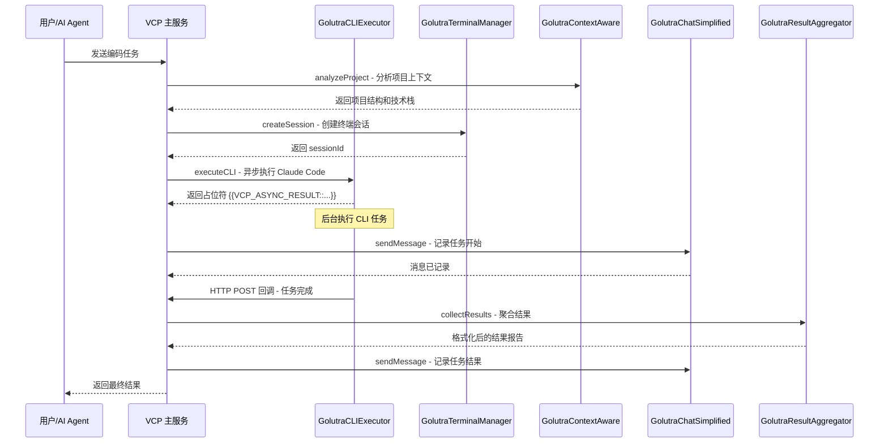
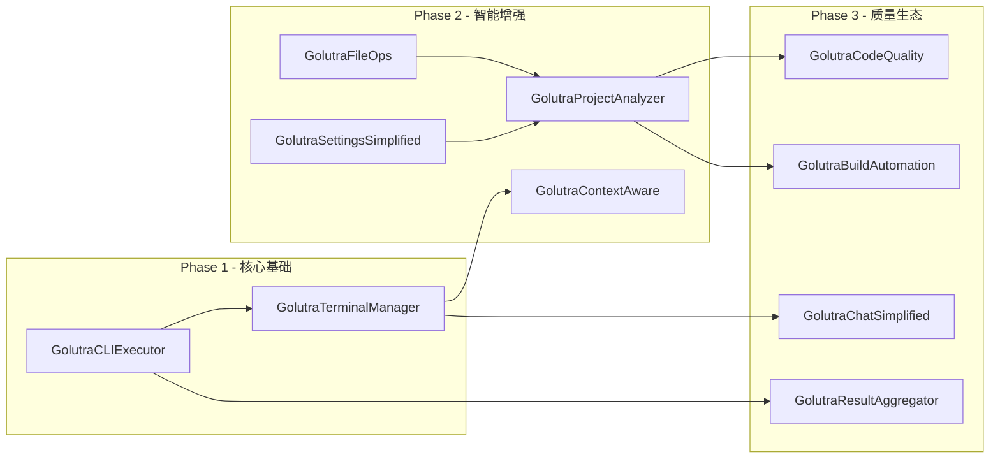

# Golutra VCP 插件改造架构方案

## 1. 项目背景与改造目标

### 1.1 当前架构

Golutra 是一个基于 **Tauri + Vue 3 + Rust** 的桌面应用，核心功能通过 Tauri IPC 在 Rust 后端与 Vue 前端之间通信。关键模块包括：

- **终端引擎** (`src-tauri/src/terminal_engine/`) — 管理 PTY 会话、CLI 工具执行、输出流控
- **终端桥接** (`src/features/terminal/terminalBridge.ts`) — Tauri IPC 封装，缓冲与 ACK 流控
- **成员会话管理** (`src/features/terminal/terminalMemberStore.ts`) — 成员终端创建、派发串行化
- **聊天系统** (`src/features/chat/chatStore.ts`, `chatBridge.ts`) — 会话管理、消息收发、终端联动
- **项目数据** (`src/features/workspace/projectStore.ts`) — 成员/路线图/技能持久化
- **设置管理** (`src/features/global/settingsStore.ts`) — 全局设置 CRUD 与持久化
- **CLI 工具注册** (`src-tauri/src/terminal_engine/default_members/`) — Claude/Gemini/Codex/OpenCode/Qwen

### 1.2 改造目标

将 Golutra 的核心功能拆分为 **10 个独立的 VCP 插件**，每个插件：

- 遵循 VCP plugin-manifest.json + config.env 规范
- 通过 **stdio** 协议与 VCP 主服务通信
- 支持 **同步** 或 **异步** 模式
- **无 UI 依赖**，去除 Vue/Tauri 前端代码
- 可独立部署、升级和组合

---

## 2. 源码到插件的映射关系

```mermaid
graph TB
    subgraph Golutra Source
        TB[terminalBridge.ts]
        TMS[terminalMemberStore.ts]
        TS[terminalStore.ts]
        CS[chatStore.ts]
        CB[chatBridge.ts]
        SS[settingsStore.ts]
        PS[projectStore.ts]
        RE[registry.rs]
        EM[emulator.rs]
        SE[session/mod.rs]
    end

    subgraph VCP Plugins - Phase 1
        P1[GolutraCLIExecutor]
        P2[GolutraTerminalManager]
    end

    subgraph VCP Plugins - Phase 2
        P3[GolutraContextAware]
        P4[GolutraFileOps]
        P5[GolutraProjectAnalyzer]
        P6[GolutraSettingsSimplified]
    end

    subgraph VCP Plugins - Phase 3
        P7[GolutraResultAggregator]
        P8[GolutraCodeQuality]
        P9[GolutraBuildAutomation]
        P10[GolutraChatSimplified]
    end

    RE --> P1
    EM --> P1
    TB --> P2
    TMS --> P2
    TS --> P2
    SE --> P2
    PS --> P3
    PS --> P5
    SS --> P6
    CS --> P10
    CB --> P10
```



---

## 3. 插件详细设计

### 3.1 GolutraCLIExecutor — CLI 执行器

| 属性 | 值 |
|------|-----|
| **类型** | asynchronous |
| **语言** | Node.js |
| **源码映射** | `registry.rs`, `claude.rs`, `gemini.rs`, `codex.rs`, `opencode.rs`, `qwen.rs` |

**核心职责**：统一管理多种 AI CLI 工具的执行

**从源码提取的逻辑**：

1. **CLI 工具注册表** — 源自 `registry.rs:52-59` 的 `DEFAULT_TERMINAL_MEMBERS` 数组，包含 6 种 CLI 工具配置
2. **命令构建** — 源自 `registry.rs:92-122` 的 `apply_unlimited_access_command()` 函数，处理 unlimited access flag 注入
3. **会话恢复** — 源自 `registry.rs:141-178` 的 `apply_resume_command()` 函数，构建 resume 命令
4. **PostReady 步骤** — 源自 `registry.rs:4-23` 的 `TerminalPostReadyStep` 枚举，定义启动后的自动化步骤

**plugin-manifest.json 设计**：

```json
{
  "manifestVersion": "1.0.0",
  "name": "GolutraCLIExecutor",
  "version": "1.0.0",
  "displayName": "Golutra CLI 执行器",
  "description": "统一管理多种 AI CLI 工具的执行，支持 Claude Code, Gemini CLI, Codex CLI, OpenCode, Qwen Code",
  "pluginType": "asynchronous",
  "entryPoint": {
    "type": "nodejs",
    "command": "node cli-executor.js"
  },
  "communication": {
    "protocol": "stdio",
    "timeout": 300000
  },
  "configSchema": {
    "CLAUDE_CODE_PATH": { "type": "string", "default": "claude" },
    "GEMINI_CLI_PATH": { "type": "string", "default": "gemini" },
    "CODEX_CLI_PATH": { "type": "string", "default": "codex" },
    "OPENCODE_PATH": { "type": "string", "default": "opencode" },
    "QWEN_CODE_PATH": { "type": "string", "default": "qwen" }
  },
  "capabilities": {
    "invocationCommands": [
      {
        "commandIdentifier": "executeCLI",
        "description": "执行指定的 CLI 工具命令。这是一个异步操作。\n参数:\n- tool (字符串, 必需): CLI工具名称，可选值: claude/gemini/codex/opencode/qwen/shell\n- command (字符串, 必需): 要执行的命令或提示词\n- args (数组, 可选): 额外命令参数\n- workspaceId (字符串, 可选): 工作区ID\n- cwd (字符串, 可选): 工作目录路径\n- unlimitedAccess (布尔, 可选): 是否启用无限制访问模式\n- resumeSessionId (字符串, 可选): 要恢复的会话ID\n返回: 动态上下文占位符 {{VCP_ASYNC_RESULT::GolutraCLIExecutor::{taskId}}}\n调用格式:\n<<<[TOOL_REQUEST]>>>\ntool_name:「始」GolutraCLIExecutor「末」,\ncommand:「始」executeCLI「末」,\ntool:「始」claude「末」,\ncommand:「始」帮我分析这个项目的架构「末」,\ncwd:「始」/path/to/project「末」\n<<<[END_TOOL_REQUEST]>>>"
      },
      {
        "commandIdentifier": "listTools",
        "description": "列出所有可用的 CLI 工具及其状态\n参数: 无\n返回: 工具列表及可用性状态"
      },
      {
        "commandIdentifier": "getToolConfig",
        "description": "获取指定工具的配置信息\n参数:\n- tool (字符串, 必需): 工具名称\n返回: 工具路径、默认参数、支持的 flag 等配置信息"
      }
    ]
  },
  "webSocketPush": {
    "enabled": true,
    "messageType": "cli_execution_status",
    "usePluginResultAsMessage": true,
    "targetClientType": "VCPLog"
  }
}
```

**实现要点说明**：

```javascript
// cli-executor.js 核心结构

// 工具注册表 - 移植自 registry.rs DEFAULT_TERMINAL_MEMBERS
const CLI_TOOLS = {
  claude: {
    id: 'claude-code',
    defaultCommand: 'claude',
    unlimitedAccessFlag: '--dangerously-skip-permissions',
    resumeTemplate: null
  },
  gemini: {
    id: 'gemini-cli',
    defaultCommand: 'gemini',
    unlimitedAccessFlag: null,
    resumeTemplate: null
  },
  codex: {
    id: 'codex-cli',
    defaultCommand: 'codex',
    unlimitedAccessFlag: '--full-auto',
    resumeTemplate: null
  },
  opencode: {
    id: 'opencode',
    defaultCommand: 'opencode',
    unlimitedAccessFlag: null,
    resumeTemplate: null
  },
  qwen: {
    id: 'qwen-code',
    defaultCommand: 'qwen',
    unlimitedAccessFlag: null,
    resumeTemplate: null
  }
};

// 命令构建 - 移植自 registry.rs apply_unlimited_access_command
function buildCommand(tool, command, options) {
  // ... 注入 unlimited access flag、resume 参数等
}

// 异步执行 + 回调模式
async function handleExecuteCLI(args) {
  const taskId = generateId();
  // 1. 立即返回占位符
  // 2. 后台 spawn 子进程执行 CLI
  // 3. 完成后通过 HTTP POST 回调主服务
}
```

---

### 3.2 GolutraTerminalManager — 终端会话管理

| 属性 | 值 |
|------|-----|
| **类型** | synchronous |
| **语言** | Node.js |
| **源码映射** | `terminalBridge.ts`, `terminalMemberStore.ts`, `terminalStore.ts` |

**核心职责**：管理终端会话生命周期和状态追踪

**从源码提取的逻辑**：

1. **会话创建** — 源自 `terminalBridge.ts:285-349` 的 `createSession()`，接受 cols/rows/cwd/memberId 等参数
2. **会话写入** — 源自 `terminalBridge.ts:356-359` 的 `writeSession()`
3. **ACK 流控** — 源自 `terminalBridge.ts:151-186` 的 `queueAck()` 机制，BUFFER_LIMIT=2000, ACK_BATCH_SIZE=5000
4. **状态追踪** — 源自 `terminalMemberStore.ts:76-84` 的 `resolveTerminalStatus()` 函数
5. **串行派发** — 源自 `terminalMemberStore.ts:674-691` 的 `enqueueTerminalDispatch()` 链式调用
6. **命令确认延迟** — 源自 `terminalMemberStore.ts:47-49` 的 `COMMAND_CONFIRM_DELAY_MS=100` 和 `COMMAND_CONFIRM_SUFFIX='\r'`

**plugin-manifest.json 设计**：

```json
{
  "manifestVersion": "1.0.0",
  "name": "GolutraTerminalManager",
  "version": "1.0.0",
  "displayName": "Golutra 终端会话管理器",
  "description": "管理终端会话的创建、写入、关闭和状态追踪",
  "pluginType": "synchronous",
  "entryPoint": {
    "type": "nodejs",
    "command": "node terminal-manager.js"
  },
  "communication": {
    "protocol": "stdio",
    "timeout": 30000
  },
  "configSchema": {
    "DEFAULT_TERMINAL_TYPE": { "type": "string", "default": "xterm-256color" },
    "SESSION_TIMEOUT": { "type": "number", "default": 300000 },
    "BUFFER_LIMIT": { "type": "number", "default": 2000 },
    "ACK_BATCH_SIZE": { "type": "number", "default": 5000 },
    "ACK_FLUSH_MS": { "type": "number", "default": 50 },
    "COMMAND_CONFIRM_DELAY_MS": { "type": "number", "default": 100 }
  },
  "capabilities": {
    "invocationCommands": [
      {
        "commandIdentifier": "createSession",
        "description": "创建新的终端会话\n参数:\n- memberId (字符串, 必需): 成员ID\n- workspaceId (字符串, 必需): 工作区ID\n- cwd (字符串, 可选): 工作目录\n- cols (数字, 可选): 终端列数\n- rows (数字, 可选): 终端行数\n- terminalType (字符串, 可选): 终端类型\n- terminalCommand (字符串, 可选): 启动命令\n- keepAlive (布尔, 可选): 是否保持会话\n返回: sessionId 和初始状态信息"
      },
      {
        "commandIdentifier": "writeToSession",
        "description": "向终端会话写入数据\n参数:\n- sessionId (字符串, 必需): 会话ID\n- data (字符串, 必需): 要写入的数据\n- confirmDelay (数字, 可选): 确认延迟毫秒数\n返回: 写入确认状态"
      },
      {
        "commandIdentifier": "dispatchCommand",
        "description": "派发命令到终端会话，支持串行化避免命令交错\n参数:\n- sessionId (字符串, 必需): 会话ID\n- command (字符串, 必需): 命令文本\n- context (对象, 可选): 派发上下文信息\n返回: 派发确认状态"
      },
      {
        "commandIdentifier": "getSessionStatus",
        "description": "获取会话状态\n参数:\n- sessionId (字符串, 必需): 会话ID\n返回: 会话状态，包含 connected/working/disconnected/pending 等"
      },
      {
        "commandIdentifier": "closeSession",
        "description": "关闭终端会话\n参数:\n- sessionId (字符串, 必需): 会话ID\n- preserve (布尔, 可选): 是否保留会话数据\n返回: 关闭确认状态"
      },
      {
        "commandIdentifier": "listSessions",
        "description": "列出指定工作区的所有会话\n参数:\n- workspaceId (字符串, 必需): 工作区ID\n返回: 会话列表及其状态"
      },
      {
        "commandIdentifier": "getSessionSnapshot",
        "description": "获取会话的屏幕快照\n参数:\n- sessionId (字符串, 必需): 会话ID\n返回: 终端屏幕文本内容"
      }
    ]
  }
}
```

**实现要点说明**：

```javascript
// terminal-manager.js 核心结构

// 会话存储 - 移植自 terminalMemberStore 的 memberSessions
const sessions = new Map();

// ACK 流控 - 移植自 terminalBridge.ts:80-84
const BUFFER_LIMIT = parseInt(process.env.BUFFER_LIMIT) || 2000;
const ACK_BATCH_SIZE = parseInt(process.env.ACK_BATCH_SIZE) || 5000;

// 串行派发链 - 移植自 terminalMemberStore.ts:74
const dispatchChains = new Map();

// 命令确认 - 移植自 terminalMemberStore.ts:47-49
const COMMAND_CONFIRM_DELAY_MS = parseInt(process.env.COMMAND_CONFIRM_DELAY_MS) || 100;
const COMMAND_CONFIRM_SUFFIX = '\r';

async function dispatchCommand(sessionId, command, context) {
  // 串行化处理，避免同一 session 命令交错
  const chain = dispatchChains.get(sessionId) || Promise.resolve();
  const task = chain.then(() => doDispatch(sessionId, command, context));
  dispatchChains.set(sessionId, task);
  return task;
}
```

---

### 3.3 GolutraContextAware — 上下文感知

| 属性 | 值 |
|------|-----|
| **类型** | synchronous |
| **语言** | Node.js |
| **源码映射** | `projectStore.ts`, `terminalMemberStore.ts` |

**核心职责**：项目上下文理解和智能提示注入

**从源码提取的逻辑**：

1. **成员归一化** — 源自 `projectStore.ts:112-177` 的 `normalizeMembers()` 函数
2. **终端类型解析** — 源自 `projectStore.ts:120-121` 的 `resolveTerminalType()` 和 `hasTerminalConfig()`
3. **终端路径解析** — 源自 `terminalMemberStore.ts:154-165` 的 `resolveTerminalPath()` 函数

**invocationCommands**：analyzeProject, getSmartCompletion, injectPrompt

---

### 3.4 GolutraFileOps — 文件操作

| 属性 | 值 |
|------|-----|
| **类型** | synchronous |
| **语言** | Node.js |
| **源码映射** | 新增功能，增强 golutra 的文件操作能力 |

**核心职责**：增强的文件操作和项目文件理解

**invocationCommands**：readProjectFile, writeProjectFile, batchFileOperation, listDirectory

---

### 3.5 GolutraProjectAnalyzer — 项目分析引擎

| 属性 | 值 |
|------|-----|
| **类型** | synchronous |
| **语言** | Node.js |
| **源码映射** | `projectStore.ts:270-294` |

**核心职责**：分析项目结构、依赖关系和技术栈

**从源码提取的逻辑**：

1. **项目数据归一化** — 源自 `projectStore.ts:271-294` 的 `normalizeProjectData()` 函数

**invocationCommands**：analyzeDependencies, detectFramework, generateProjectReport

---

### 3.6 GolutraSettingsSimplified — 设置管理

| 属性 | 值 |
|------|-----|
| **类型** | synchronous |
| **语言** | Node.js |
| **源码映射** | `settingsStore.ts` |

**核心职责**：基本的配置读取和设置修改

**从源码提取的逻辑**：

1. **设置结构** — 源自 `settingsStore.ts:91-99` 的 `SettingsState` 类型，包含 appearance/locale/account/notifications/keybinds/chat/members 7 个分类
2. **设置归一化** — 源自 `settingsStore.ts:289-349` 的 `normalizeSettings()` 函数
3. **设置持久化** — 源自 `settingsStore.ts:368-373` 的 `persistSettings()` 函数，写入 `global-settings.json`
4. **自定义成员管理** — 源自 `settingsStore.ts:181-211` 的 `normalizeCustomMember()` 和 `buildCustomMembers()` 函数
5. **终端路径映射** — 源自 `settingsStore.ts:242-258` 的 `normalizeTerminalPaths()` 函数

**plugin-manifest.json 设计**：

```json
{
  "manifestVersion": "1.0.0",
  "name": "GolutraSettingsSimplified",
  "version": "1.0.0",
  "displayName": "Golutra 设置管理器",
  "description": "管理应用配置的读取、修改、导入和导出",
  "pluginType": "synchronous",
  "entryPoint": {
    "type": "nodejs",
    "command": "node settings-simplified.js"
  },
  "communication": {
    "protocol": "stdio",
    "timeout": 10000
  },
  "configSchema": {
    "SETTINGS_FILE_PATH": { "type": "string", "default": "global-settings.json" },
    "CONFIG_BACKUP_ENABLED": { "type": "boolean", "default": true },
    "AUTO_SAVE_INTERVAL": { "type": "number", "default": 300 }
  },
  "capabilities": {
    "invocationCommands": [
      {
        "commandIdentifier": "getSetting",
        "description": "读取配置项\n参数:\n- key (字符串, 必需): 配置键名，支持点号分隔的路径如 account.displayName\n- category (字符串, 可选): 配置分类 (appearance/locale/account/notifications/keybinds/chat/members)\n返回: 配置值和类型信息"
      },
      {
        "commandIdentifier": "setSetting",
        "description": "修改配置项\n参数:\n- key (字符串, 必需): 配置键名\n- value (任意, 必需): 配置值\n- category (字符串, 可选): 配置分类\n返回: 保存状态和归一化后的值"
      },
      {
        "commandIdentifier": "exportSettings",
        "description": "导出配置文件\n参数:\n- format (字符串, 可选): 导出格式 json/yaml，默认json\n- categories (数组, 可选): 要导出的配置分类列表\n返回: 配置文件内容"
      },
      {
        "commandIdentifier": "importSettings",
        "description": "导入配置文件\n参数:\n- configData (字符串, 必需): 配置文件内容\n- format (字符串, 可选): 配置格式 json/yaml\n返回: 导入结果和冲突报告"
      },
      {
        "commandIdentifier": "resetSettings",
        "description": "恢复默认设置\n参数:\n- category (字符串, 可选): 仅重置特定分类\n返回: 重置后的设置快照"
      }
    ]
  }
}
```

---

### 3.7 GolutraResultAggregator — 结果聚合

| 属性 | 值 |
|------|-----|
| **类型** | synchronous |
| **语言** | Node.js |
| **源码映射** | 新增功能 |

**核心职责**：收集和整理多个任务的执行结果

**invocationCommands**：collectResults, generateReport

---

### 3.8 GolutraCodeQuality — 代码质量

| 属性 | 值 |
|------|-----|
| **类型** | asynchronous |
| **语言** | Node.js |
| **源码映射** | 新增功能 |

**核心职责**：运行静态代码分析和质量检查

**invocationCommands**：runLinting, analyzeComplexity, generateQualityReport

---

### 3.9 GolutraBuildAutomation — 自动化构建

| 属性 | 值 |
|------|-----|
| **类型** | asynchronous |
| **语言** | Node.js |
| **源码映射** | 新增功能 |

**核心职责**：检测构建系统并执行自动化构建

**invocationCommands**：detectBuildSystem, executeBuild, getBuildStatus

---

### 3.10 GolutraChatSimplified — 聊天简化版

| 属性 | 值 |
|------|-----|
| **类型** | synchronous |
| **语言** | Node.js |
| **源码映射** | `chatStore.ts`, `chatBridge.ts` |

**核心职责**：简化的消息管理和历史记录查询

**从源码提取的逻辑**：

1. **会话归一化** — 源自 `chatStore.ts:172-198` 的 `normalizeConversation()` 函数
2. **消息归一化** — 源自 `chatStore.ts:200-223` 的 `normalizeMessage()` 函数
3. **会话排序** — 源自 `chatStore.ts:225-238` 的 `sortConversations()` 函数
4. **消息发送** — 源自 `chatStore.ts:607-651` 的 `sendMessage()` 函数，MAX_MESSAGE_LENGTH=1200
5. **消息分页** — 源自 `chatStore.ts:490-516`，MESSAGES_PAGE_LIMIT=200
6. **未读同步** — 源自 `chatStore.ts:251-280` 的 `applyUnreadSync()` 函数

**plugin-manifest.json 设计**：

```json
{
  "manifestVersion": "1.0.0",
  "name": "GolutraChatSimplified",
  "version": "1.0.0",
  "displayName": "Golutra 聊天管理器",
  "description": "简化的消息管理和历史记录查询",
  "pluginType": "synchronous",
  "entryPoint": {
    "type": "nodejs",
    "command": "node chat-simplified.js"
  },
  "communication": {
    "protocol": "stdio",
    "timeout": 15000
  },
  "configSchema": {
    "MESSAGE_LIMIT": { "type": "number", "default": 1000 },
    "MAX_MESSAGE_LENGTH": { "type": "number", "default": 1200 },
    "MESSAGES_PAGE_LIMIT": { "type": "number", "default": 200 },
    "HISTORY_RETENTION_DAYS": { "type": "number", "default": 30 }
  },
  "capabilities": {
    "invocationCommands": [
      {
        "commandIdentifier": "sendMessage",
        "description": "发送消息到指定对话\n参数:\n- conversationId (字符串, 必需): 对话ID\n- content (字符串, 必需): 消息内容，最大1200字符\n- senderId (字符串, 必需): 发送者ID\n返回: 消息发送状态、消息ID和时间戳"
      },
      {
        "commandIdentifier": "getHistory",
        "description": "获取对话历史记录\n参数:\n- conversationId (字符串, 必需): 对话ID\n- limit (数字, 可选): 返回消息数量限制，默认200\n- beforeId (字符串, 可选): 获取指定消息之前的记录\n返回: 消息列表和分页信息"
      },
      {
        "commandIdentifier": "searchMessages",
        "description": "搜索历史消息\n参数:\n- query (字符串, 必需): 搜索关键词\n- conversationId (字符串, 可选): 限制在特定对话中搜索\n返回: 匹配的消息列表"
      },
      {
        "commandIdentifier": "listConversations",
        "description": "列出所有对话\n参数:\n- workspaceId (字符串, 必需): 工作区ID\n返回: 对话列表，包含最近消息预览和未读数"
      }
    ]
  }
}
```

---

## 4. 插件协同工作流程



---

## 5. 目录结构

```
plugins/
├── GolutraCLIExecutor/
│   ├── plugin-manifest.json
│   ├── config.env
│   ├── cli-executor.js          # 入口文件
│   ├── lib/
│   │   ├── tool-registry.js     # CLI 工具注册表 (来自 registry.rs)
│   │   ├── command-builder.js   # 命令构建器 (来自 registry.rs)
│   │   ├── process-manager.js   # 子进程管理
│   │   └── callback-handler.js  # 异步回调处理
│   └── package.json
│
├── GolutraTerminalManager/
│   ├── plugin-manifest.json
│   ├── config.env
│   ├── terminal-manager.js      # 入口文件
│   ├── lib/
│   │   ├── session-store.js     # 会话存储 (来自 terminalMemberStore)
│   │   ├── ack-controller.js    # ACK 流控 (来自 terminalBridge)
│   │   ├── dispatch-chain.js    # 串行派发 (来自 terminalMemberStore)
│   │   └── status-tracker.js    # 状态追踪
│   └── package.json
│
├── GolutraContextAware/
│   ├── plugin-manifest.json
│   ├── config.env
│   ├── context-aware.js
│   ├── lib/
│   │   ├── project-analyzer.js
│   │   ├── completion-engine.js
│   │   └── prompt-injector.js
│   └── package.json
│
├── GolutraFileOps/
│   ├── plugin-manifest.json
│   ├── config.env
│   ├── file-ops.js
│   ├── lib/
│   │   ├── file-reader.js
│   │   ├── file-writer.js
│   │   └── batch-processor.js
│   └── package.json
│
├── GolutraProjectAnalyzer/
│   ├── plugin-manifest.json
│   ├── config.env
│   ├── project-analyzer.js
│   ├── lib/
│   │   ├── dependency-parser.js
│   │   ├── framework-detector.js
│   │   └── report-generator.js
│   └── package.json
│
├── GolutraSettingsSimplified/
│   ├── plugin-manifest.json
│   ├── config.env
│   ├── settings-simplified.js
│   ├── lib/
│   │   ├── settings-normalizer.js  # (来自 settingsStore 归一化逻辑)
│   │   ├── settings-store.js
│   │   └── import-export.js
│   └── package.json
│
├── GolutraResultAggregator/
│   ├── plugin-manifest.json
│   ├── config.env
│   ├── result-aggregator.js
│   ├── lib/
│   │   ├── result-collector.js
│   │   └── report-formatter.js
│   └── package.json
│
├── GolutraCodeQuality/
│   ├── plugin-manifest.json
│   ├── config.env
│   ├── code-quality.js
│   ├── lib/
│   │   ├── lint-runner.js
│   │   ├── complexity-analyzer.js
│   │   └── quality-reporter.js
│   └── package.json
│
├── GolutraBuildAutomation/
│   ├── plugin-manifest.json
│   ├── config.env
│   ├── build-automation.js
│   ├── lib/
│   │   ├── build-detector.js
│   │   ├── build-executor.js
│   │   └── build-cache.js
│   └── package.json
│
└── GolutraChatSimplified/
    ├── plugin-manifest.json
    ├── config.env
    ├── chat-simplified.js
    ├── lib/
    │   ├── conversation-store.js  # (来自 chatStore 归一化/排序逻辑)
    │   ├── message-store.js
    │   └── search-engine.js
    └── package.json
```

---

## 6. 实现优先级与依赖关系



### Phase 1 — 核心基础

| 插件 | 依赖 | 说明 |
|------|------|------|
| GolutraCLIExecutor | 无 | 最核心的功能，独立可运行 |
| GolutraTerminalManager | GolutraCLIExecutor | 需要 CLI 执行器创建的进程来管理 |

### Phase 2 — 智能增强

| 插件 | 依赖 | 说明 |
|------|------|------|
| GolutraContextAware | GolutraTerminalManager | 需要终端会话的上下文 |
| GolutraFileOps | 无 | 独立文件操作 |
| GolutraProjectAnalyzer | GolutraFileOps, GolutraSettingsSimplified | 依赖文件操作和配置读取 |
| GolutraSettingsSimplified | 无 | 独立配置管理 |

### Phase 3 — 质量生态

| 插件 | 依赖 | 说明 |
|------|------|------|
| GolutraResultAggregator | GolutraCLIExecutor | 聚合 CLI 执行结果 |
| GolutraCodeQuality | GolutraProjectAnalyzer | 需要项目分析结果 |
| GolutraBuildAutomation | GolutraProjectAnalyzer | 需要构建系统检测 |
| GolutraChatSimplified | GolutraTerminalManager | 终端输出关联聊天 |

---

## 7. 技术规范要点

### 7.1 通用 stdin/stdout 通信模板

每个插件都遵循以下 I/O 模式：

```javascript
// 通用入口模板
async function main() {
  let inputData = '';
  
  // 1. 从 stdin 读取 JSON
  for await (const chunk of process.stdin) {
    inputData += chunk;
  }
  
  const request = JSON.parse(inputData.trim());
  
  // 2. 根据 command 分发
  let result;
  switch (request.command || request.command1) {
    case 'createSession':
      result = await handleCreateSession(request);
      break;
    // ... 其他 command
    default:
      // 检查是否是批量调用 (command1, command2, ...)
      result = await handleBatchRequest(request);
  }
  
  // 3. 输出结果到 stdout
  console.log(JSON.stringify({ status: 'success', result }));
  process.exit(0);
}
```

### 7.2 异步插件回调模板

```javascript
// 异步插件回调模板
function startBackgroundTask(taskId, args) {
  const thread = async () => {
    try {
      const result = await executeTask(args);
      
      // 回调主服务
      const callbackUrl = `${process.env.CALLBACK_BASE_URL}/${process.env.PLUGIN_NAME_FOR_CALLBACK}/${taskId}`;
      await fetch(callbackUrl, {
        method: 'POST',
        headers: { 'Content-Type': 'application/json' },
        body: JSON.stringify({
          requestId: taskId,
          status: 'Succeed',
          result
        })
      });
    } catch (error) {
      // 错误回调
    }
  };
  
  // 在非阻塞方式启动
  thread();
}
```

### 7.3 批量调用支持

参考 VCP 手册中的 `command1/command2` 模式，所有插件需要支持批量调用：

```javascript
async function handleBatchRequest(request) {
  const results = [];
  let index = 1;
  
  while (request[`command${index}`]) {
    const command = request[`command${index}`];
    const params = extractParamsForIndex(request, index);
    const result = await handleSingleCommand(command, params);
    results.push({ command, index, ...result });
    index++;
  }
  
  return { batchResults: results, totalCommands: index - 1 };
}
```

### 7.4 超栈追踪支持

处理分布式文件访问的插件需要支持 `FILE_NOT_FOUND_LOCALLY` 错误码：

```javascript
async function readFileWithFallback(filePath) {
  try {
    return await fs.readFile(filePath);
  } catch (error) {
    if (error.code === 'ENOENT' && filePath.startsWith('file://')) {
      console.log(JSON.stringify({
        status: 'error',
        code: 'FILE_NOT_FOUND_LOCALLY',
        error: '本地文件未找到，需要远程获取。',
        fileUrl: filePath
      }));
      process.exit(1);
    }
    throw error;
  }
}
```

---

## 8. 与原有 Golutra 的兼容策略

改造后的 VCP 插件体系与原有 Golutra 桌面应用可以共存：

1. **渐进迁移** — 先实现 VCP 插件，原有 Tauri 应用继续运行
2. **数据格式兼容** — 设置文件 `global-settings.json` 结构保持一致
3. **API 对齐** — 插件的 command 参数与原有 Tauri IPC 命令保持语义对齐
4. **双向桥接** — 未来可以在 Golutra 中通过 VCP 客户端调用这些插件
